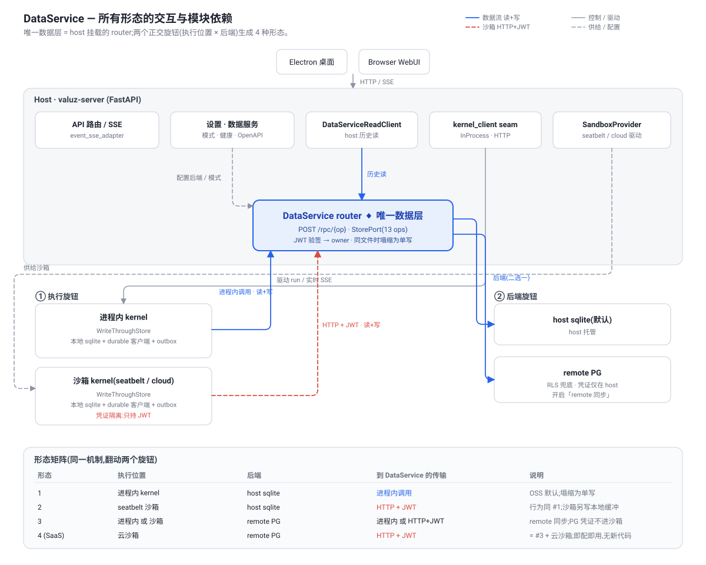

# DataService Architecture

[中文版](data-service-architecture.zh-CN.md)

> The **DataService** is the single CRUD layer for the kernel's three tables
> (`sessions` / `messages` / `events`). Every read and write of kernel data
> flows through it. This document is the source of truth for its architecture,
> its interaction flows, and how the deployment **forms** (local, sandboxed,
> remote-synced, SaaS) are all the *same mechanism* with two swappable knobs.
>
> Companion docs: [architecture.md](../architecture.md) (system topology),
> [kernel-sandbox-deployment.md](kernel-sandbox-deployment.md) (sandbox
> provisioning).

---

## 1. Principle

**One data layer, always in the path.** The kernel never talks to a database
driver for its three tables directly in production wiring — it talks to the
**DataService**, a small set of CRUD operations (the `StorePort` surface)
exposed as a **FastAPI router mounted on the host app** (`POST /rpc/{op}`, one
op per StorePort method). There is **no separate DataService process**; it is a
host sub-router.

The DataService has a **swappable backend** and is reached over a **swappable
transport**. Everything else — "local", "sandboxed", "remote PG", "SaaS" — is a
combination of those two knobs. There is no separate code path per form.

```
        kernel (in-process OR in a sandbox)
                     │  StorePort
                     ▼
        ┌─────────────────────────────┐
        │  DataService  (host router)  │     ← the ONE data layer
        │  POST /rpc/{op}              │
        └──────────────┬──────────────┘
                       ▼  backend (swappable)
         ┌─────────────┴──────────────┐
         │ host sqlite (default)       │  OR  remote PG (when "remote sync" on)
         └─────────────────────────────┘
```

---

## 2. Two orthogonal knobs

| Knob | Values | Chosen by | Effect |
|------|--------|-----------|--------|
| **Execution location** | in-process kernel · seatbelt sandbox · (future) cloud sandbox | deployment / `VALUZ_SANDBOX_DRIVER` | *where the agent loop runs* and therefore the **transport** to the DataService (in-process call vs HTTP) |
| **DataService backend** | host sqlite (default, → `valuz.db`) · remote PG · remote HTTP | **environment variables** (`KERNEL_STORE` + `VALUZ_DURABLE_DATABASE_URL` / `VALUZ_DATA_API_*`), loaded at boot | *where kernel data is durably stored*; remote PG/HTTP turns on the **JWT auth boundary** |

These are **independent**. Sandboxing does not imply remote PG; remote PG does
not imply a sandbox. Any combination is valid.

> **Config is env-driven, not a GUI.** The OSS build has no Data-Service settings
> page — the backend is selected purely from the environment at boot (a
> config→backend factory, one code path). The `KERNEL_STORE` value names the
> backend implementation; there is **no `local` special case that bypasses the
> DataService** — `local` simply means "backend = host sqlite (`valuz.db`)".

---

## 3. Deployment forms (the knob matrix)

| # | Execution | Backend | Transport to DataService | Notes |
|---|-----------|---------|--------------------------|-------|
| 1 | in-process kernel (no sandbox) | host sqlite (`valuz.db`) | **in-process** call | OSS default. The kernel keeps writing its execution-local `kernel.db` (invariant, post kernel-DB-split); the DataService **dual-writes** the 3 tables into the host `valuz.db` and reads are served from there. |
| 2 | seatbelt sandbox | host sqlite (`valuz.db`) | **HTTP** (sandbox → host callback URL, JWT) | Behaviour identical to #1 from the user's view. Sandbox writes its own local sqlite (buffer); the DataService converges the host `valuz.db`. |
| 3 | in-process **or** sandbox | **remote PG** | in-process or HTTP | "Remote sync" configured. Data additionally lands in the remote PG via the DataService. With a sandbox the **JWT boundary** ensures the **PG credentials never enter the sandbox**. |
| 4 (SaaS) | cloud sandbox | remote PG | HTTP, JWT | The same as #3 with an ephemeral cloud sandbox + central PG — **config-and-go** because the mechanism is identical. |

The point: forms 1→4 are one implementation with the two knobs flipped. SaaS is
not a fork — it is form 3 with a cloud sandbox driver and a PG backend.

The diagram below shows all forms' interactions and module dependencies (blue =
data flow / read+write, red dashed = the sandbox HTTP+JWT boundary):



---

## 4. Write path — dual-write + outbox consistency

A write does **two** things:

1. **Local sqlite** (the kernel's execution-local store — sandbox-local, or the
   host's when in-process). Fast, always-available, survives DataService blips.
2. **DataService** (→ host sqlite or remote PG). The durable / shared copy that
   reads are served from.

To guarantee the DataService copy is **maximally consistent** even across a
transient DataService/PG unavailability, a DataService write that fails is
recorded in a **`durable_outbox`** (in the local sqlite) and **re-pushed** by a
background drainer until it lands. Replay is idempotent (`event_uid` for events,
UUID PKs for sessions/messages), so at-least-once redelivery is safe. This is
the role `durable_outbox` was built for: **eventual consistency of the
dual-write into the DataService.**

**Collapse optimization (now rarely applies).** When the execution-local sqlite
and the DataService's backend resolve to the **same file**, the dual-write
collapses to a single write. Historically this was form 1 — but after the
**kernel-DB split** (`kernel.db` separate from the host `valuz.db`), the OSS
default has **two distinct files** (`kernel.db` execution-local, `valuz.db`
DataService backend), so form 1 is now a genuine dual-write. Collapse applies
only when an explicit shared `database_url` co-locates the kernel's own store and
the DataService backend in one store.

**Event seq.** Each physical store owns its own `events` autoincrement; the
sequences are **independent** and bridged by `event_uid`. The seq a reader sees
is the **DataService backend's** seq (reads come from there). Never force one
store's seq onto another's PK (it collides with pre-existing ids and drops rows).

---

## 5. Read path — always via the DataService

Reads (history reconstruction: `get_events` / `get_events_window` / session &
message fetches) are served by the **DataService backend** — never from the
execution-local sqlite. Rationale: a sandbox (especially a cloud sandbox) is
**ephemeral**; its local sqlite may be gone, so it cannot be the read source.

- **Form 1** (in-process + sqlite): the host reads via the **in-process**
  DataService → host sqlite. No HTTP.
- **Forms 2–4** (sandbox and/or PG): the host reads via the DataService router
  → backend. Because the DataService lives on the **host**, history reads
  succeed **even when the sandbox kernel is gone**. Live, non-persisted deltas
  (`text_delta` / `tool_output_delta`, etc.) still stream from the kernel's live
  bus while the sandbox is alive; once it is gone, the stream degrades to
  history-only.

---

## 6. Auth & isolation boundary

The DataService derives the **owner** for every request from a **verified
bearer token** (HS256 JWT today; the `TokenVerifier` port allows RS256/JWKS for
SaaS), never from the request body. Consequences:

- A **sandbox holds only a short-lived JWT** + the DataService URL. It never
  receives a DB DSN, driver, or PG credential — the credential lives only on the
  host (the DataService's backend config).
- On a **remote PG** backend, **Row-Level Security** is the DB-side backstop:
  the DataService stamps `app.current_user_id` per transaction (`SET LOCAL`) from
  the verified token, and connects as a **non-owner role** so the RLS policy is
  enforced even if an app-layer filter is ever missed.
- The owner-from-token rule means a compromised sandbox cannot read or write
  another owner's data.

---

## 7. Transport

The DataService client surface is identical regardless of transport; only the
binding differs:

| Execution | Binding | Wire |
|-----------|---------|------|
| in-process kernel | direct call into the host DataService router (or its store) | none |
| sandbox kernel | HTTP `POST /rpc/{op}` to the host callback URL | JSON rows + `Bearer <jwt>` |

The host's own consumers (SSE adapter, etc.) use the in-process binding; only a
sandboxed kernel crosses the HTTP boundary.

---

## 8. Interaction flows

### 8.1 Write (sandbox kernel, remote PG backend — form 3/4)

```
agent turn → kernel.append_event
   ├─ write sandbox-local sqlite            (buffer; fast)
   └─ POST /rpc/append_event  ─HTTP+JWT─▶  host DataService
                                              ├─ verify JWT → owner
                                              ├─ SET LOCAL app.current_user_id
                                              └─ INSERT … RETURNING seq → PG
        on HTTP/PG failure ▶ enqueue durable_outbox(local) ▶ drainer re-pushes
```

### 8.2 Read history (host, sandbox already destroyed)

```
client opens session → host SSE adapter
   └─ DataService (host router) → PG: get_events_window / get_events_after
        → translated to legacy SSE frames → client            (no kernel needed)
   live deltas: subscribe kernel SSE → sandbox gone → history-only (graceful)
```

### 8.3 Default (in-process + sqlite — form 1, collapsed)

```
kernel.append_event → DataService (in-process) → host sqlite   (single write)
reads → DataService (in-process) → host sqlite
```

---

## 9. Control plane

**All behaviour is controlled by environment variables, loaded at boot** — a
config→backend factory with one code path, no GUI and no bespoke launch script
per form. (An earlier iteration exposed a Data-Service settings page; the OSS
build dropped it in favour of pure env config — simpler, and the right shape for
consuming OSS as a SaaS submodule.)

| Env | Values | Meaning |
|-----|--------|---------|
| `KERNEL_STORE` | `local` (default) · `pg` · `remote` | names the DataService backend implementation |
| `VALUZ_DURABLE_DATABASE_URL` | asyncpg DSN | PG backend (`pg`) |
| `VALUZ_DATA_API_URL` / `VALUZ_DATA_API_TOKEN` / `VALUZ_DATA_API_KIND` | URL + JWT | remote HTTP DataService (`remote`) |

- `local` → backend = host sqlite (`valuz.db`). **The DataService is still fully
  in the path** — `local` is a backend choice, not a bypass.
- **No `make dev-remote`.** A thin **`make pg` / PG-podman helper** only brings up
  a local Postgres; it prints the `export KERNEL_STORE=pg` +
  `VALUZ_DURABLE_DATABASE_URL=…` lines to run before `make dev`. Infra is
  decoupled from behaviour.

---

## 10. SaaS extension

SaaS is **form 4 with no new code paths**: a cloud sandbox driver (execution
knob) + a central PG backend (backend knob), both already abstracted. Because
the DataService + JWT boundary are identical to the local forms, the cloud
sandbox and the centralized PG are **config-and-go**: the SaaS overlay binds a
cloud `SandboxDriver` and points the DataService backend at the managed PG;
nothing in the kernel or the data layer changes.

---

## 11. Implementation status & the remaining refactor

**Landed:** the `/rpc/{op}` DataService app + StorePort surface
(`kernel/app/data_service.py`), the `store_wire` codec, JWT signer/verifier +
`TokenVerifier` port, RLS migration, `event_uid` idempotency, the
`durable_outbox` table + `DurableOutbox` drainer; **env-var config**
(`KERNEL_STORE` + `VALUZ_DURABLE_DATABASE_URL` / `VALUZ_DATA_API_*`) replacing the
former settings page; the host DataService mounted as a router at
`/internal/data`; the **typed `DataReader` port** (`adapters/data_reader.py`)
bound at the composition root, with **session + event reads routed through it**
(`data_reader()` — host reads its mounted store in-process, sandbox-agnostic);
the `make pg` helper replacing `make dev-remote`. Validated by
`scripts/e2e_host_data_service.py` (host DS over real PG, JWT round-trip).

**The remaining gap — DataService not yet *always* the data layer.** Today
`bind_data_service` / `_build_durable_store` short-circuit `KERNEL_STORE=local`
(early return → no durable, `data_reader()` falls back to the kernel seam). So the
OSS default does **not** run form 1 as designed. Closing this is the current
refactor, decided as follows:

1. **Config→backend factory, one code path.** `_build_durable_store(config)`
   returns a store for **every** tier and never `None`:
   `local` → in-process `SQLAlchemyStore` over **host sqlite (`valuz.db`)**;
   `pg` → PG; `remote` → HTTP. Delete the `if local: return` special cases in
   `dependencies.py` and `boot/steps.bind_data_service`; boot **always**
   `bind_data_reader(LocalDataServiceReader(store))`. `_KernelClientReader` stays
   only as the out-of-process fallback (an http kernel the host can't read
   in-process).
2. **OSS default = sqlite DataService over `valuz.db`** (co-locate — decision "a").
   `kernel.db` remains the kernel's execution-local store (invariant); the
   DataService dual-writes to `valuz.db` and reads are served from it.
3. **Authority = durable.** Reads come from the DataService backend
   (`valuz.db` / PG); `kernel.db` is the execution-local buffer. Uniform across
   tiers (matches `pg`≡`remote`). The `durable_outbox` local-authority path stays
   dormant.
4. **Schema handling — no new alembic migration for the co-located tables.** The
   durable's kernel tables are built by `_ensure_durable_schema` (`create_all`,
   idempotent) — the same mechanism `pg` uses, now pointed at `valuz.db`. Kernel
   tables (create_all) coexist with host `valuz_*` tables (host alembic) in
   `valuz.db`; the kernel alembic chain keeps managing `kernel.db`.
5. **Data migration — mandatory, one-time, at boot.** Existing installs have
   kernel history only in `kernel.db`; once reads come from `valuz.db` it must be
   seeded. The boot step `boot/kernel_db_colocate.py` copies `kernel.db`'s
   3 tables → `valuz.db` (backup → copy → verify, idempotent via `event_uid` /
   UUID PKs). It **replaces** the retired `kernel_db_split.py` (which moved
   tables the opposite way and is incompatible with co-location).
   Reuses the `scripts/backfill_durable_sessions.py` logic with a
   sqlite target.

Each item lands incrementally behind the contract test
(`test_data_service_contract.py` pins route↔client↔StorePort) and the full
suite. Two engines opening the one `valuz.db` (host + DataService) is safe under
WAL + `busy_timeout` (verified at boot).
