# Session Live Replay 与 User Event Transport

> **状态**: Proposed · 待 PR 评审  
> **目标 PR**: `docs: design live replay event transport for session deltas`  
> **关联文档**:
> [event-delivery-unification.md](event-delivery-unification.md),
> [event-delivery-unification-impl-notes.md](event-delivery-unification-impl-notes.md),
> [session-stream-lifetime.md](session-stream-lifetime.md),
> [task-kernel-migration.md](task-kernel-migration.md),
> 以及商业版 `../valuz/docs/design/sandbox-scope-allocation.md`。

## 1. 问题与结论

**问题**: 新 session / 新 turn 刚开始时, 如果前端因为 hidden、focus 离开、切 session、连接预算保护或网络抖动断开 live stream, 再回来时只能从 durable events 回放。由于 `text_delta` / `tool_input_delta` / `workflow_progress` 等 delta 明确不持久化, 这些 live-only frame 在断开窗口内永久丢失, transcript 就无法从当前 message turn 的开头恢复打字机过程。

**核心修复原理**: 在不持久化 delta 的前提下, durable history 只能恢复 canonical final state, 不能恢复 live-only streaming state。要恢复断线窗口内的 delta, 必须在 kernel 内提供一个**有界、内存态、短期可重放的 live log**: 每个 live-only frame 获得 `(live_generation, live_seq)`, reconnect 时按 `after_live_seq` replay; replay 窗口过期或 sandbox 换代时显式返回 `live_gap`, 前端回落到 canonical final event。

**架构结论**: 修复不应该继续堆页面级 SSE 生命周期判断, 而应该落成三层:

1. **Kernel `LiveReplayBus`**: delta 不落库, 但进入 bounded in-memory ring buffer, 支持 `subscribe(after_live_seq)`;
2. **Host `UserEventHub` / user-level transport**: 一条 user 级连接承载 lifecycle control plane 与 selected session live subscription, 通过 `peek` 连接已有 kernel, 不为看历史 provision sandbox;
3. **Frontend `SessionRuntimeStore`**: stream lifecycle 从 `ConversationPage` 页面局部状态上移到 app 级 store, 切 session/hidden 只改变订阅策略, 不清空 running session 的 partial state。

这个设计保留后端"不持久化 delta"的决策, 同时把不可恢复边界说清楚: **同 generation 且 buffer 未过期时恢复 delta; 否则发 `live_gap`, 只保证 durable canonical state**。

## 2. 当前地基

`event-delivery-unification` 已经把系统推向一个正确方向:

- durable history 由 DataService / events 表负责, 带 `after_seq` 游标, 可跨进程/跨沙箱恢复;
- user-level `/v1/stream` 已经承载 lifecycle control plane;
- session-level `/v1/sessions/{id}/events/stream` 已经采用 backfill-then-live, 并在 cloud sandbox scope 模式下通过 `peek` / re-peek 避免为了看历史而 provision sandbox;
- live-only delta 明确不进入 DB, 包括 `text_delta`, `thinking_delta`, `tool_input_delta`, `tool_output_delta`, `workflow_progress`。

这份文档不是重做 durable event delivery, 而是补齐 durable history 覆盖不了的 live-only delta 恢复层。

## 3. Codex 参考模型

这套设计参考了 `openai/codex` app-server 的事件模型, 但不是照搬协议。Codex 的核心思想不是"把所有 delta 持久化后重放", 而是把对话拆成 **Thread / Turn / Item** 三层, 用 item lifecycle 表达可恢复状态:

- `thread/start` / `thread/resume` / `thread/fork` 把客户端订阅到某个 thread 的 turn/item events;
- `turn/start` 后客户端持续读取 JSON-RPC notifications, 包括 `item/started`, `item/completed`, `item/agentMessage/delta`, command/tool progress 等;
- `item/agentMessage/delta` 只是 live UI 增量, 客户端按 `itemId` 顺序拼接;
- `item/completed` 携带最终 item, 是权威状态, 历史投影基于 completed item, 而不是基于 delta 重放;
- `thread/items/list` / `thread/turns/list` 读取持久化历史, 可在不 resume thread 的情况下分页;
- `thread/unsubscribe` 只取消当前 connection 的订阅, thread 不会立刻 unload, 而是在无订阅且无活动一段时间后关闭。

Codex 给本设计的结论有三条:

1. **delta 是 live experience, final item 是 canonical state。** Valuz 继续不持久化 delta 是合理的, 但必须明确"delta 丢了以后只能回到 canonical final event"。
2. **订阅应该是 connection/thread 级能力, 不是页面局部副作用。** Valuz 需要把 stream lifecycle 从 `ConversationPage` 提到 `SessionRuntimeStore` / `UserEventHub`。
3. **高频 delta 和低频 lifecycle 要分层。** Valuz 的 `/v1/stream` 继续做 user lifecycle control plane; selected session 的 delta 走 data plane 或 user-level transport 的显式 subscription。

本设计采用 Codex 的部分:

| Codex 原理 | Valuz 对应设计 |
|---|---|
| Thread / Turn / Item lifecycle | Session / turn / message-or-tool item 的 reducer state |
| `item/started -> delta* -> item/completed` | partial delta 先渲染, canonical event 到达后覆盖 |
| `item/completed` 是权威状态 | persisted `assistant_message` / `tool_use` / `session_idle` 是权威历史 |
| connection 订阅 thread events | `UserEventHub` 管理 user connection 的 session subscriptions |
| 可 opt out 高频 notification | control plane 默认不携带 token/tool delta |
| thread unsubscribe 后延迟 unload | frontend unsubscribe 不等于清空 session runtime cache |

本设计不采用 Codex 的部分:

- 不把 Valuz 现有 REST/SSE API 一次性替换成 Codex app-server JSON-RPC;
- 不要求所有 client 立即迁移到 WebSocket, 旧 session SSE 保持兼容;
- 不改变 Valuz 的 durable DataService 作为 system of record;
- 不把商业 sandbox pool / AGS generation 逻辑放进 OSS, 只在 OSS seam 上表达 `live_generation`。

**额外差异**: Codex app-server 的 thread 通常由一个长驻 app-server process 承载; Valuz 商业版可能每 session / 每 task / 每 turn 换 cloud sandbox。因此 Valuz 必须比 Codex 多一个 `live_generation` 维度, 用来区分不同 sandbox instance 或 turn generation, 防止把旧实例的 `live_seq` 套到新实例。

## 4. 设计目标

### 4.1 目标

- **不持久化 delta**: 不改变 `_NON_PERSISTED_TYPES` 的产品/存储决策。
- **断线短期恢复**: 同一 kernel 实例仍存活、live buffer 未过期时, reconnect 可以按 `after_live_seq` 补齐 live-only delta。
- **可显式降级**: live buffer 过期、sandbox 换代或实例已销毁时, 服务端显式发 `live_gap`, 前端回落到 canonical final state, 不假装能补 delta。
- **控制连接数**: Electron/Chromium 不再为多个 session 打开多个常驻 SSE; user-level transport 管理订阅集合。
- **兼容商业云沙箱**: OSS 被 vendor 到商业版后, per-owner/per-session/per-task sandbox scope 和 per-turn new instance 都能表达 live generation。
- **渐进落地**: 先复用现有 SSE 和 `iter_events_sse`, 后续再收敛到 WebSocket/单连接 transport。

### 4.2 非目标

- 不把 token delta 写入 durable DB。
- 不保证进程重启后恢复 delta。进程重启后的恢复边界仍然是 persisted canonical events。
- 不把 AGS/COS/商业沙箱调度逻辑放进 OSS; OSS 只定义 edition-agnostic seam。
- 不要求一次性删掉现有 `/v1/sessions/{id}/events/stream`; 旧接口需要长期兼容。

## 5. 目标形态

```text
Frontend App
  └─ SessionRuntimeStore                    app 级, 非页面级
      ├─ UserEventTransport                 1 条 user-level transport
      ├─ SessionEventCache[session_id]       durable + live partial state
      └─ SubscriptionPolicy                 selected/running/grace/hidden

Host / OSS
  └─ UserEventHub
      ├─ DurableHistoryReader               DataService / events 表, 权威历史
      ├─ LiveKernelTapManager               peek existing kernel, never provision for viewing
      └─ SubscriptionRegistry               user connection -> session live subscriptions

Kernel / Sandbox
  └─ LiveReplayBus
      ├─ per-session ring buffer            live-only, in-memory, bounded
      ├─ live_seq + live_generation          replay cursor
      └─ subscribe(after_live_seq)           replay buffered suffix, then future events
```

核心语义:

- durable cursor: `after_seq`, 只属于 DataService / events 表;
- live cursor: `(live_generation, after_live_seq)`, 只属于当前 live kernel/buffer;
- `event_uid` 仍用于 durable/live 重叠去重;
- live-only frame 无 durable seq, 不能推进 `after_seq`;
- final/canonical events 到达后覆盖 partial delta 视图。

### 5.1 完整模块连接图

```mermaid
flowchart LR
  subgraph FE["Frontend"]
    Page["ConversationPage\nview + composer only"]
    Store["SessionRuntimeStore\nsession cache + reducers"]
    Policy["SubscriptionPolicy\nselected/running/hidden/grace"]
    Transport["UserEventTransport\n1 user-level connection"]
    CompatSSE["compat Session SSE\n/v1/sessions/:id/events/stream"]
    Page --> Store
    Store --> Policy
    Store --> Transport
    Store -. phase 1 fallback .-> CompatSSE
  end

  subgraph Host["Host / OSS API"]
    EventsRoute["/v1/events WS or Streamable HTTP\nfuture bidirectional subscribe"]
    UserStream["/v1/stream SSE\nlifecycle control plane"]
    SessionStream["/v1/sessions/:id/events/stream\nsession data plane"]
    Messages["POST /v1/sessions/:id/messages"]
    Hub["UserEventHub\nmultiplex + subscriptions"]
    IterUser["iter_user_events_sse\nexisting control-plane loop"]
    IterSession["iter_events_sse\nbackfill + live merge"]
    History["DurableHistoryReader\nDataReader / DataService"]
    Tap["LiveKernelTapManager\npeek existing kernel"]
    KClient["KernelClient seam\nHTTP or in-process"]
    Alloc["SandboxAllocatorPort\nensure / peek / release"]

    EventsRoute --> Hub
    UserStream --> IterUser
    SessionStream --> IterSession
    Hub --> History
    Hub --> Tap
    IterUser --> History
    IterUser --> Tap
    IterSession --> History
    IterSession --> Tap
    Tap --> KClient
    KClient --> Alloc
    Messages --> KClient
  end

  subgraph Kernel["Kernel / Sandbox"]
    KRoutes["Kernel HTTP/SSE/WS routes"]
    Bus["SessionEventBus\nbest-effort fanout"]
    Replay["LiveReplayBus\nbounded live-only replay"]
    Sink["PersistThenBroadcastSink"]
    DBsink["DatabaseEventSink\npersistent rows only"]
    Runtime["Agent Runtime\nClaude/Codex/DeepAgents"]
    KStore["Kernel Store / RemoteStore\nDataService write-through"]

    KRoutes --> Bus
    KRoutes --> Replay
    Runtime --> Sink
    Sink --> DBsink
    Sink --> Bus
    Sink --> Replay
    DBsink --> KStore
  end

  subgraph Commercial["Commercial Cloud Sandbox Overlay"]
    PoolAlloc["CommercialPoolAllocator\nscope + new_turn"]
    Orchestrator["SandboxOrchestrator\ninstance registry + locks"]
    AGS["AGS sandbox instance\nlive_generation = instance_id/turn_id"]
    PoolAlloc --> Orchestrator --> AGS
  end

  Transport --> EventsRoute
  Transport -. current control path .-> UserStream
  CompatSSE --> SessionStream
  KClient --> KRoutes
  History --> KStore
  Alloc -. commercial binding .-> PoolAlloc
```



连接面说明:

| 连接 | 方向 | 语义 |
|---|---|---|
| `ConversationPage -> SessionRuntimeStore` | frontend local | 页面只选择 session 和渲染, 不拥有 stream 生命周期 |
| `UserEventTransport -> /v1/events` | frontend -> host | 中期目标: 一条连接动态 `session.subscribe` / `unsubscribe` |
| `Session SSE -> iter_events_sse` | frontend -> host | 短期兼容路径: selected session 单流, 增加 live replay cursor |
| `UserEventHub -> DurableHistoryReader` | host local | 用 `after_seq` 补 persisted events, 不依赖 sandbox 存活 |
| `UserEventHub -> LiveKernelTapManager` | host local | 用 `peek` 找已有 kernel, 不为看历史 provision sandbox |
| `Kernel routes -> LiveReplayBus` | host -> kernel | 用 `(live_generation, after_live_seq)` replay live-only delta |
| `PersistThenBroadcastSink -> DatabaseEventSink` | kernel local | persisted canonical events 落 durable store |
| `PersistThenBroadcastSink -> LiveReplayBus` | kernel local | live-only delta 进入 bounded in-memory log |
| `SandboxAllocator.ensure(new_turn=True)` | host -> overlay | 商业 scope 模式可为新 turn 换 sandbox generation |

### 5.2 打开 / 重连 / 切回 selected session 时序

```mermaid
sequenceDiagram
  autonumber
  participant Page as ConversationPage
  participant Store as SessionRuntimeStore
  participant Transport as UserEventTransport
  participant Hub as UserEventHub / iter_events_sse
  participant History as DurableHistoryReader
  participant Alloc as SandboxAllocator.peek
  participant Kernel as Kernel subscribe_session_events
  participant Replay as LiveReplayBus

  Page->>Store: selectSession(session_id)
  Store->>Transport: subscribe(session_id, after_seq, live_generation, after_live_seq)
  Transport->>Hub: session.subscribe

  Hub->>History: get_events(session_id, after_seq)
  History-->>Hub: persisted frames with durable seq
  Hub-->>Transport: session.history frames
  Transport-->>Store: reduce persisted frames, advance after_seq

  Hub->>Alloc: peek(owner_user_id, scope_for(session_id))
  alt no live kernel
    Alloc-->>Hub: None
    Hub-->>Transport: history-only heartbeat
    Note over Hub,Alloc: re-peek later; never provision just for viewing
  else live kernel exists
    Alloc-->>Hub: lease(endpoint, generation)
    Hub->>Kernel: subscribe(session_id, generation, after_live_seq)
    Kernel->>Replay: replay after live cursor
    alt replay available
      Replay-->>Kernel: live-only frames > after_live_seq
      Kernel-->>Hub: replayed live frames
      Hub-->>Transport: session.live_delta
      Transport-->>Store: reduce partial delta, advance live cursor
    else replay expired or generation missing
      Replay-->>Kernel: live_gap
      Kernel-->>Hub: live_gap
      Hub-->>Transport: session.live_gap
      Transport-->>Store: mark partial incomplete; wait for canonical final
    end
    Kernel-->>Hub: future live frames
    Hub-->>Transport: session.live_delta / lifecycle
  end
```

这个时序替代页面级 `abortRef` / `visibilitychange` 判断: hidden、切 session、网络断开只影响 `SubscriptionPolicy`, 恢复时统一走 `after_seq + after_live_seq`。

### 5.3 发送新 turn 与 cloud sandbox generation 时序

```mermaid
sequenceDiagram
  autonumber
  participant FE as SessionRuntimeStore
  participant API as Host POST /messages
  participant KC as KernelClient._kernel_for(new_turn=True)
  participant Alloc as SandboxAllocator.ensure
  participant Overlay as CommercialPoolAllocator / Orchestrator
  participant Kernel as Kernel Runtime
  participant Sink as PersistThenBroadcastSink
  participant Replay as LiveReplayBus
  participant Data as DataService durable events
  participant Hub as UserEventHub

  FE->>API: sendMessage(session_id, prompt)
  API->>KC: run_turn(user_id, session_id, new_turn=True)
  KC->>Alloc: ensure(owner, scope_for(session), new_turn=True)
  alt local / boot singleton
    Alloc-->>KC: lease(endpoint=None, generation=fixed)
  else commercial scoped sandbox
    Alloc->>Overlay: ensure scope; maybe provision new instance
    Overlay-->>Alloc: lease(endpoint, generation=instance_id or turn_id)
    Alloc-->>KC: lease(endpoint, generation)
  end

  KC->>Kernel: run_turn(session_id)
  Kernel->>Sink: user_message / session_update running
  Sink->>Data: persist canonical rows
  Sink->>Replay: optional lifecycle live frame
  Sink-->>Hub: live lifecycle
  Hub-->>FE: running lifecycle

  loop token/tool/workflow deltas
    Kernel->>Sink: text_delta / tool_input_delta / workflow_progress
    Sink->>Replay: publish live-only with live_seq
    Replay-->>Hub: live frame(generation, live_seq)
    Hub-->>FE: session.live_delta
  end

  Kernel->>Sink: assistant_message / tool_use / session_idle
  Sink->>Data: persist canonical final rows
  Sink-->>Hub: final lifecycle/canonical frame
  Hub-->>FE: canonical final overwrites partial state
```

商业 scope 模式的关键点在第 5 步: 如果 `new_turn=True` 触发了新 sandbox, `generation` 必须变化。前端旧 cursor `(old_generation, old_live_seq)` 不能套到新实例; host 需要先发 `session.live_generation_started`, 再从新 generation 的 live seq 开始交付。

## 6. Wire Contract

### 6.1 Frame Envelope

新增或扩展 live frame envelope:

```json
{
  "scope": "session",
  "session_id": "ses_123",
  "turn_id": "turn_456",
  "message_id": "msg_789",
  "event_type": "message.assistant.delta",
  "payload": { "text": "..." },
  "event_uid": null,
  "durable_seq": null,
  "live_generation": "instance-or-turn-generation",
  "live_seq": 42,
  "timestamp": 1784898000000
}
```

要求:

- `durable_seq` 可空; live-only delta 必须为空。
- `live_seq` 只在同一个 `live_generation` 内单调。
- `live_generation` 在商业 cloud sandbox 中建议使用 `sandbox_instance_id` 或 `turn_id`。本地/boot singleton 可使用固定 generation。
- `message_id` 是前端聚合 partial 的主键; 没有 `message_id` 时使用 `turn_id + item/tool_use_id` 兜底。

### 6.2 Subscription Request

中期目标 transport 使用 WebSocket:

```json
{
  "type": "session.subscribe",
  "session_id": "ses_123",
  "after_seq": 1200,
  "live_generation": "inst_abc",
  "after_live_seq": 41,
  "include": ["delta", "tool_delta", "workflow_progress", "lifecycle"]
}
```

服务端行为:

1. 先从 durable history backfill `after_seq`;
2. 再 peek 当前 session scope 的 kernel;
3. 如果当前 generation 与请求 generation 一致, 从 `after_live_seq` replay live buffer;
4. 如果 generation 不一致, 发 `session.live_generation_started`;
5. 如果 requested seq 已被逐出, 发 `session.live_gap`;
6. 然后进入 future live stream。

短期仍可在 session SSE 上扩展 query params:

```text
GET /v1/sessions/{id}/events/stream
  ?after_seq=1200
  &live_generation=inst_abc
  &after_live_seq=41
```

## 7. Kernel 侧能力

### 7.1 LiveReplayBus

新增 kernel 内部模块, 建议位于 `backend/kernel/src/core/live_replay_bus.py` 或现有 `session_bus` 附近。

接口草案:

```python
@dataclass(frozen=True)
class LiveReplayCursor:
    generation: str
    seq: int

@dataclass(frozen=True)
class LiveReplayFrame:
    session_id: str
    type: str
    data: dict[str, Any]
    live_generation: str
    live_seq: int
    timestamp: int
    event_uid: str | None = None

class LiveReplayBus:
    def publish(self, session_id: str, event: EventData) -> LiveReplayFrame: ...

    async def subscribe(
        self,
        session_id: str,
        *,
        after: LiveReplayCursor | None,
        types: tuple[str, ...] | None = None,
    ) -> AsyncIterator[LiveReplayFrame | LiveGapFrame]: ...
```

实现要求:

- 只缓存 `_NON_PERSISTED_TYPES` 和必要的 live progress; persisted events 仍走现有 sink / DataService。
- ring buffer 按 session 分桶, bounded by `max_events`, `max_bytes`, `ttl_seconds`。
- publish 不得阻塞 runtime。慢 subscriber 仍然可以丢未来 frame, 但 reconnect 可从 ring buffer 补。
- buffer overflow 时标记最小可 replay seq; 请求早于该 seq 返回 `live_gap`。
- `live_generation` 由 kernel boot / sandbox lease 注入。商业 per-turn sandbox 必须保证每个新实例/turn generation 可区分。

### 7.2 Sink 接入点

现有链路:

```text
runtime emits kernel event
  -> PersistThenBroadcastSink
      -> persisted event: DB write + live broadcast
      -> live-only event: live broadcast only
```

调整:

```text
live-only event
  -> LiveReplayBus.publish(...)
  -> live broadcast with live_seq/live_generation
```

持久化事件可选进入 live bus 的原因是去重/边界更简单, 但不是必须。推荐只缓存 live-only frame, 以避免重复维护一个第二历史。

### 7.3 Kernel HTTP/SSE API

扩展:

- `subscribe_session_events(session_id, after_live_seq?, live_generation?, types?)`;
- `subscribe_all_events(types?)` 保持 lifecycle-only 用法, 不承载 token delta;
- `EventData` 增加可选字段 `live_seq`, `live_generation`, `live_gap`.

兼容:

- 未传 `after_live_seq` 时行为等同现有 live tap;
- 旧 kernel 不支持 live replay 时, host 返回 feature flag false, 前端只做 canonical fallback。

## 8. Host / OSS 基础设施

### 8.1 UserEventHub

新增 host 深模块, 建议位于:

```text
backend/valuz_agent/modules/events/user_event_hub.py
```

职责:

- 管理一个 user connection 的订阅集合;
- multiplex user control plane 与 selected session live data plane;
- 对每个 session 执行 durable backfill + live replay merge;
- 维护 subscription -> kernel tap task 生命周期;
- 将 live gap 显式传给前端。

它不应该知道 AGS/COS, 只通过 `kernel_client` seam 工作。

### 8.2 LiveKernelTapManager

复用现有关键 seam:

- `_kernel_for_existing(user_id, scope)` 使用 `ext.sandbox_allocator.peek`, 不 provision;
- `subscribe_session_events_existing(user_id, session_id)` 作为当前 tap 基础;
- scope resolver 继续决定 session scope / task scope。

新增:

```python
async def subscribe_session_events_existing(
    user_id: str,
    session_id: str,
    *,
    live_generation: str | None = None,
    after_live_seq: int | None = None,
    types: tuple[str, ...] | None = None,
) -> AsyncIterator[EventData]:
    ...
```

### 8.3 Transport 选择

短期:

- 保留 `/v1/stream` lifecycle-only;
- 保留 `/v1/sessions/{id}/events/stream`, 增加 live replay params;
- 前端 `SessionRuntimeStore` 负责最多 1 条 selected session stream。

中期:

- 新增 `GET /v1/events` WebSocket 或 Streamable HTTP;
- 客户端在一条连接上发送 `session.subscribe` / `session.unsubscribe`;
- `UserEventHub` 根据订阅集合 multiplex frame。

为什么中期需要 WebSocket:

- SSE 是 server -> client 单向, 动态切 selected session 需要重连整条 stream 或开新 stream;
- WebSocket 能在不增加连接数的前提下动态修改订阅集合;
- Electron 6 connection budget 下, 单 user transport 更稳定。

但 WebSocket **不是这个问题的银弹**。它只解决 browser/Electron client 到 SaaS host 的"一条连接 + 动态订阅"问题, 不解决 delta 恢复本身:

| 问题 | WebSocket 是否解决 | 仍需要什么 |
|---|---:|---|
| 6 条 SSE 连接预算 | 是 | user-level single transport |
| selected session 动态切换 | 是 | `session.subscribe` / `unsubscribe` 协议 |
| hidden/focus 离开后补 live-only delta | 否 | kernel `LiveReplayBus` + `after_live_seq` |
| sandbox 换实例后识别旧 cursor 失效 | 否 | `live_generation` + `live_gap` |
| app / kernel 进程重启后恢复 delta | 否 | 除非引入持久 broker, 否则只恢复 canonical durable history |
| 多端同时看同一 session | 部分 | 共享 runtime cache; 是否需要 fan-out broker 取决于成本目标 |

因此推荐的中期边界是:

```text
Client ── WebSocket/Streamable HTTP ── Host UserEventHub
Host   ── existing KernelClient tap ── Existing live kernel, via allocator.peek
Kernel ── DataService write-through ── Durable canonical history
Kernel ── LiveReplayBus(in-memory) ── Short replay window for live-only delta
```

这个边界**不要求**商业云沙箱和 SaaS host 之间先引入持久队列, 也不要求 pod 亲和:

- host API pod 可以从共享 sandbox registry / allocator `peek` 到同一个 sandbox endpoint;
- viewer 在 pod A、run 在 pod B 时, 二者都可以直连该 sandbox kernel 的 live tap;
- durable history 由 DataService 兜底, 任意 pod 都能按 `after_seq` 读;
- client 断线后即使重连到另一个 pod, 仍带 `after_seq + live_generation + after_live_seq` 恢复。

只有在下面场景成立时, 才应该引入中间件:

| 场景 | 推荐中间件语义 | 是否必须持久 |
|---|---|---:|
| 多 pod 重复订阅同一 sandbox kernel 成本太高 | Redis Pub/Sub / NATS core 做非持久 fan-out | 否 |
| 需要跨 pod 共享 live delta replay, 减少每 pod 各自连 kernel | Redis Streams / NATS JetStream, TTL retention | 短期持久, 但仍不是 DB canonical |
| sandbox 无法被 host pod 反向连接, 只能主动上报 | sandbox -> broker/ingress reverse stream | 取决于断线容忍 |
| 要求 kernel 死亡后仍恢复 delta 打字机过程 | durable broker with retention | 是, 但这等价于持久化 delta 的另一种形态 |

本设计选择先不把 broker 放进 P0。原因是 P0 bug 的最小正确解是 live replay + user-level transport; broker 会把问题扩大到多 pod fan-out、消费确认、保留策略、租户隔离和清理成本, 并且如果要求 kernel 死亡后恢复 delta, 实质上已经推翻"后端不持久化 delta"的前提。

### 8.4 DataService / Durable Reader

无需改变 durable schema 语义, 但要确保:

- `get_events_after_for_user(user_id, after_seq, types?)` 可按 owner 读全局 lifecycle;
- `get_events(user_id, session_id, after_seq)` 仍是 session transcript history;
- `event_uid` 对 persisted events 稳定, 供 live/durable dedup。

## 9. Frontend 重构模块

### 9.1 SessionRuntimeStore

新增 app 级 store, 建议在 `frontend/packages/core/src/session-runtime/`:

```text
session-runtime/
  runtime-store.ts
  transport.ts
  reducers.ts
  selectors.ts
  subscription-policy.ts
  types.ts
```

职责:

- 按 session 保存 durable events, live partial events, cursors, status;
- 页面切换不清空 running session 的 partial state;
- hidden / focus / selected session 只影响订阅策略, 不直接销毁业务状态;
- final/canonical event 到达后替换 partial delta;
- 收到 `live_gap` 后标记该 message 的 partial 不完整, 等待 canonical final event。

### 9.2 ConversationPage 收敛

`ConversationPage` 不再直接持有 stream:

```text
ConversationPage(selectedSessionId)
  -> useSessionRuntime(selectedSessionId)
  -> turns / busy / send / interrupt
```

要移出的局部状态:

- `abortRef`;
- `historyCursorRef`;
- `seenEventUidsRef`;
- `subscribeToSession`;
- inline `appendEvent` / gap-fill;
- visibilitychange stream abort 逻辑。

页面仍保留:

- composer UI;
- scroll/pin refs;
- selected session rendering;
- user action handlers。

### 9.3 SubscriptionPolicy

建议默认策略:

| session 状态 | selected | hidden | 策略 |
|---|---:|---:|---|
| idle/terminal | any | any | no live delta subscription; durable history only |
| running | yes | no | subscribe live delta |
| running | yes | yes | keep live delta for `active_hidden_grace`, then disconnect with replay cursor |
| running | no | no | keep lifecycle; optional delta grace 30-120s |
| running | no | yes | lifecycle only; rely on replay/canonical when selected again |

注意: 如果产品要求"切 session 后仍看到完整打字机过程", 就必须让 unselected running session 也持续订阅, 或要求 kernel live replay buffer 覆盖整个离开时长。否则只能保证 canonical final state。

## 10. 商业云沙箱兼容

商业版通过 `vendor/valuz-oss` 使用 OSS host/kernel seam, 并启用 cloud sandbox。需要额外关注:

### 10.1 Scope 与 Generation

当前商业 scope 设计允许:

- owner singleton;
- session scope;
- task scope;
- chat 每 turn new instance (`new_turn=True`)。

因此 live cursor 不能只按 `session_id` 记, 必须是:

```text
(session_id, live_generation, live_seq)
```

`live_generation` 推荐来源:

- owner singleton / local: fixed kernel generation;
- per-session sandbox: sandbox instance id;
- per-turn sandbox: turn id 或 sandbox instance id;
- task sandbox: task sandbox instance id。

### 10.2 Lease Metadata

OSS `SandboxLease` 可 additive 扩展:

```python
@dataclass(frozen=True)
class SandboxLease:
    endpoint: SandboxEndpoint | None = None
    generation: str | None = None
    scope_key: str | None = None
```

商业 overlay 填:

- `generation = instance_id`;
- `scope_key = scope.key`;
- host 将 generation 传给 `HttpKernelClient` / live subscription。

旧 allocator 忽略这些字段, 保持兼容。

### 10.3 Re-peek 与实例换代

`iter_events_sse` 现有 re-peek 逻辑继续保留, 但语义升级:

- re-peek 到同 generation: 可 replay `after_live_seq`;
- re-peek 到新 generation: 发 `session.live_generation_started`;
- 旧 generation 的 live buffer 不可达: 对旧 partial 发 `live_gap`, 不再等待。

这能覆盖 "scope 模式每 turn 换实例, 旧实例心跳还在但新 turn 已在新实例跑" 的历史问题。

## 11. Failure Semantics

| 场景 | 期望行为 |
|---|---|
| 短暂 hidden / focus 离开 | reconnect 后以 `after_live_seq` 补 live-only delta |
| 切 session 后短时间回来 | 若 buffer 未过期, 补 delta; 否则 `live_gap` + canonical final |
| sandbox instance 被销毁 | 无 live replay; durable backfill + `live_gap` |
| app 进程重启 | 无 live replay; durable history only |
| live buffer overflow | `live_gap(min_available_seq)` |
| durable final event 到达 | 覆盖 partial, 清理 incomplete 标记 |
| remote kernel unreachable | history-only; re-peek; 不 provision |

`live_gap` 是一等产品状态, 前端不要展示为错误 toast。它只表示"打字机过程不可恢复", 不表示最终回答丢失。

## 12. Rollout Plan

### PR 1: 文档与接口冻结

- 增加本文档;
- 在 contracts / architecture 中引用 live replay 语义;
- 确定 `live_generation/live_seq/live_gap` 字段命名。

### PR 2: Kernel LiveReplayBus

- 增加 kernel ring buffer;
- live-only sink 写入 replay bus;
- kernel session SSE 支持 `after_live_seq`;
- 单测覆盖 replay / gap / ttl / overflow。

### PR 3: Host adapter 扩展

- `KernelClient` seam 增加 live replay 参数;
- `HttpKernelClient` 透传 query params;
- `iter_events_sse` 合并 durable backfill + live replay;
- cloud scope re-peek 带 generation;
- 测试 local + remote fake kernel。

### PR 4: Frontend SessionRuntimeStore

- 新增 core store;
- selected session 通过 store 订阅;
- `ConversationPage` 删除页面级 stream ownership;
- hidden/focus 变成 subscription policy;
- 重点回归新 session 首 turn, 切 session, hidden 后返回, interrupt, queue draining。

### PR 5: UserEventHub / 单连接 transport

- 新增 `/v1/events` WebSocket 或 Streamable HTTP;
- 复用 `/v1/stream` lifecycle projection;
- session subscribe/unsubscribe 动态切换;
- 保留旧 SSE 兼容。

### PR 6: 商业云沙箱联调

在 `../valuz` 中验证:

- per-session sandbox: hidden 后 replay;
- per-turn new sandbox: generation 切换;
- task scope: lead + member 不串线;
- sandbox TTL/release 后 `live_gap` + canonical fallback;
- 多 pod: viewer 与 runner 不同 pod 时仍通过 registry/re-peek 找到同一 live generation。

## 13. PR 草案

标题:

```text
docs: design live replay event transport for session deltas
```

摘要:

```text
This PR documents the next event-delivery step after the user-level control
plane: live-only session deltas remain non-persistent, but become short-term
replayable through a kernel LiveReplayBus and a user-level event transport.

It defines:
- the Codex app-server principles we are borrowing and the parts we are not copying;
- live_generation/live_seq/live_gap wire semantics;
- kernel-side bounded replay buffer requirements;
- host UserEventHub and KernelClient seam changes;
- frontend SessionRuntimeStore refactor boundaries;
- commercial cloud-sandbox generation/scope requirements for vendored OSS.

The design intentionally preserves the backend decision not to persist delta
fragments. If replay is unavailable or expired, clients must fall back to
canonical persisted events instead of pretending the delta stream is complete.
```

Review focus:

- Does the Codex-derived split between live deltas and canonical completed state fit Valuz's product semantics?
- Is `live_generation` the right abstraction for commercial per-turn sandbox instances?
- Should the medium-term transport be WebSocket, or should we keep SSE and reconnect on subscription changes?
- Do we accept direct host->sandbox live taps for P0, or do we need a broker for fan-out/cost reasons?
- What ring buffer limits are acceptable for desktop and cloud kernels?
- Should `SandboxLease.generation` be part of the stable OSS contract, or remain an optional overlay hint?
