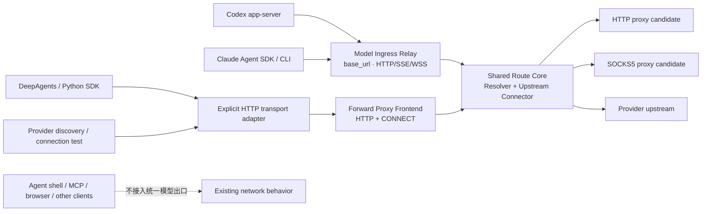

# 统一网络出口管理 — 设计

> 状态：**Implemented canary / Revision 3**（2026-08-07）。本文是 Valuz 统一网络出口能力的单一设计来源；实现仍受本地 feature gate 保护，尚未默认启用。
>
> 取向一句话：**桌面端由 Electron 提供统一的路由解析与上游连接内核；Codex/Claude 通过各自的模型 `base_url` 接入仅监听 loopback 的薄模型入口，DeepAgents/Provider Test 通过显式 HTTP transport 接入正向出口，两类前端共享原始代理环境变量、系统代理/PAC 与直连决策，同时禁止把 Valuz 新增的标准代理变量扩散到 agent shell、MCP 或整个 sidecar。**

---

## 0. 摘要

Valuz 当前支持多个 runtime 和第三方模型通道，但每个 runtime 独立连接模型上游：

- Claude Agent 通过 `ANTHROPIC_BASE_URL` / `ANTHROPIC_AUTH_TOKEN` 连接 Anthropic Messages 兼容端点。
- Codex 通过动态 `model_provider` 配置连接 OpenAI Responses 兼容端点。
- DeepAgents 通过 `ChatAnthropic`、`ChatOpenAI` 或 `ChatGoogleGenerativeAI` 连接对应协议端点。
- OAuth 订阅通道不注入 API Key，由 Claude/Codex CLI 读取自身登录态。

这种“runtime 直连 Provider”的设计简单、透明，但桌面 GUI 启动的 Electron、Python sidecar、Rust/Node CLI 和 Python SDK 属于不同网络栈。Electron/Chromium 能读取系统代理，不代表 sidecar 和它启动的模型客户端也能读取；macOS GUI 启动通常也不会加载用户 shell 中的 `HTTP_PROXY` / `HTTPS_PROXY`。结果是同一台机器上 UI 网络正常，而 Codex/Claude 可能直连失败、长时间重试或反复重连。

本设计增加一个 runtime 中立的 **Valuz Egress Manager**，由一个共享路由内核和两类接入前端组成：

1. Electron 在启动 sidecar 前创建共享的 Outbound Resolver / Upstream Connector。
2. Codex 通过 `model_providers.<id>.base_url`、Claude 通过 `ANTHROPIC_BASE_URL` 指向仅监听 loopback 的薄模型入口；该入口只代理模型 HTTP/SSE/WSS，不依赖进程级 `HTTP_PROXY` / `HTTPS_PROXY`。
3. DeepAgents 与 Provider discovery/test 通过显式 HTTP transport 接入本地正向出口；不依赖进程级 `trust_env` 碰巧生效。
4. 两类入口都按真实上游 URL 解析原始 env、系统代理/PAC 或明确的用户策略，并复用相同的 DIRECT / HTTP proxy / SOCKS5 建连实现。
5. 正向出口保持目标 TLS 端到端；薄模型入口会终止 loopback HTTP 后重新建立上游 TLS，因此技术上可接触 headers/body，但首期不解析、不改写、不记录正文。
6. 连接路径、解析耗时、失败阶段和模型首事件时间统一关联并可诊断。
7. 默认模式对用户不可见；网络失败时提供可理解的恢复操作，并保留不依赖新出口实现的兼容逃生通道。

它解决的是“请求怎样稳定、可解释地到达上游”，不是“请求发给哪个模型、怎样改写正文”。后者属于本地模型网关，不在本期范围。

### 0.1 当前实现与准入状态

Revision 3 已在代码中形成一条可运行、默认关闭的 canary 路径：Electron main process 持有 Resolver、Upstream Connector、薄模型入口、正向出口、控制面和本地诊断；backend 只消费一次性 bootstrap，并按 runtime instance 申请短期 descriptor。打包端通过 sidecar stdin 交付 bootstrap，开发端在权限为 `0700` 的临时目录中发布一次性 `0600` rendezvous 文件，backend 校验 owner/type/inode 后读取并立即删除。两种路径都不会把出口 secret 写进普通环境变量或日志。

启用方式：

```bash
# 开发模式：desktop 先启动并发布 bootstrap，再启动 backend
VALUZ_EGRESS_FRONTENDS=1 ./scripts/dev.sh

# 打包 Electron canary
<desktop-executable> --enable-valuz-egress-frontends

# 紧急恢复旧路径（最高优先级）
VALUZ_EGRESS_MODE=off
```

当前 admission allowlist 有意小于产品已有 runtime/provider 矩阵：

| Runtime / 认证 | 当前路径 | 状态与原因 |
|---|---|---|
| Codex + Responses-compatible API Key | synthetic `model_provider.base_url` → model ingress | 已接入；锁定 Codex `0.144.4` 的真实 `command/exec` 与 stdio MCP 测试确认专用模型 key 不进入工具子进程；adapter 会拒绝 MCP 对该专用 key 名称的显式请求，同时保留显式请求的普通用户 env |
| Codex + OpenAI OAuth | 旧路径 | 尚未准入；HTTP/WSS、remote compaction 与登录态矩阵未完成 |
| Claude + Anthropic-compatible API Key + `default/full_access`（非首次 plan） | `ANTHROPIC_BASE_URL` → model ingress | 已接入；每次 spawn 重验 credential-isolation gate，锁定 Claude `2.1.220` 的真实 stdio MCP 测试确认模型凭证被剥离、普通用户 env 保留 |
| Claude + OAuth，或 API Key + `auto_review`/首次 plan | 旧路径 | 尚未准入；锁定 CLI 的 scrub 与这些权限语义不等价 |
| DeepAgents + OpenAI-compatible / Anthropic-compatible | explicit SDK transport → forward proxy | 已接入；同步/异步 client 都显式 `trust_env=false`，shell/MCP env 不变 |
| DeepAgents + Gemini | 旧路径 | 尚未准入；锁定 SDK 的显式 transport 隔离尚未完成 |
| Provider discovery / connection test | owned `httpx`/SDK client → forward proxy | 已接入；操作结束即撤销 capability |

“旧路径”只表示该组合不加入本 canary，不表示其已受统一出口监控。任何未通过 Phase 0 的组合都不能为了覆盖率而退回进程级 `HTTP_PROXY` 注入。

已实现的恢复与监控闭环包括：`auto/direct/off`、启动失败 fail-loud、能力租约续期/撤销/过期、PAC 解析失败重试、连接失败后立即失效该 origin 的路由缓存、覆盖完整候选链与代理握手的 10 秒建连预算、候选短路与明确 fallback、按 `(runtime client, target origin)` 的健康快照、runtime phase 时间线、3 秒本地 UI 刷新及二次 schema allowlist 的脱敏复制。详细事件不落盘、不上传，也不主动探测任意 Provider。

尚未完成默认开启所需的平台/真实 runtime 验收：macOS/Windows Finder/Dock 与睡眠唤醒矩阵、需要交互认证的系统代理、常见 PAC/Clash 组合、Codex OAuth/WSS/compaction、Claude OAuth/resume/subagent、Gemini 显式 transport，以及 §16 的性能基线。feature gate 必须保持默认关闭，直到这些项有可复现证据。

2026-08-07 的实现验证快照：使用仓库支持的 bundled Node 24 执行 `make test-all`，backend 为 3672 passed / 4 skipped，frontend 为 181 files / 1314 tests passed；本次改动的 Ruff、desktop/app ESLint、desktop/frontend typecheck 与新增 backend 定向 Mypy 均无新增错误。全仓 `make typecheck` 仍被既有 65 个 backend 文件中的 277 条 Mypy 债务阻断，`make lint` 仍先被 8 条既有跨模块 datastore 边界违规阻断；frontend 全量 lint 的 design-audit 也存在与本功能文件无关的既有 baseline 增量。因此 §16.19 尚不是“全仓绿色”，不能据此解除 canary gate。

---

## 1. 背景与问题

### 1.1 当前进程边界

桌面形态的网络链路是：

```text
Finder / Dock / launchd
        │
        ▼
Electron desktop
        │ spawn
        ▼
Python valuz-server sidecar
        │
        ├─ spawn Codex app-server
        ├─ spawn Claude Agent SDK CLI
        └─ in-process DeepAgents / Provider discovery
```

各层读取代理设置的能力不同：

| 层 | 默认能看到的代理信息 |
|---|---|
| Electron renderer / Chromium | macOS/Windows 系统代理与 PAC |
| Electron main 的 Node HTTP 栈 | 通常不自动使用 Chromium 系统代理 |
| Python sidecar / httpx | 主要依赖进程环境变量或显式 client 配置 |
| Codex / Claude 子进程 | 继承 sidecar 环境，具体支持能力由 CLI 网络栈决定 |
| TUN | 对进程透明，由操作系统路由，不要求应用理解代理 |

因此，“系统代理已开启”不等于“模型客户端已使用该代理”。

### 1.2 当前 Provider 路径

Host 在创建 session 时把 Provider 解析为：

```text
ModelProvider {
  base_url,
  api_key,
  api_protocol
}
```

解析入口是 `backend/valuz_agent/adapters/provider_resolver.py`；Provider 行保存 `base_url`、`protocol` 与 `secret_ref`，凭证从 secret store 读取。Kernel 在 `backend/kernel/src/runtimes/factory.py` 校验 runtime 与协议兼容性：

| Runtime | 支持协议 |
|---|---|
| Claude Agent | Anthropic Messages |
| Codex | OpenAI Responses |
| DeepAgents | Anthropic Messages、OpenAI Chat Completions、Gemini |

本设计保留这个模型，不引入跨协议转换，也不改变 session 的 `(runtime, provider, model)` 锁定语义。

### 1.3 目标问题

统一出口必须解决：

- GUI 启动拿不到 shell 代理环境变量。
- 系统代理/PAC 无法自动传递给 Python 和模型 CLI。
- 国内、海外、自定义、内网与 localhost 目标需要不同路由。
- 代理不可用时底层客户端可能重试数分钟，用户看不到卡在哪一层。
- Provider 连接测试与正式模型请求可能使用不同网络路径。
- 每个 runtime 各自补代理逻辑会形成长期漂移。

---

## 2. 目标与非目标

### 2.1 目标

1. **单一出口策略**：Codex、Claude、DeepAgents、Provider 探测与其他明确纳入范围的外部模型请求使用同一套路由决策。
2. **逐 URL 决策**：依据最终上游 URL、PAC 和用户策略决定代理或直连，不按“国内/海外”硬编码。
3. **桌面系统代理接入**：Electron 通过 `session.resolveProxy()` 读取 macOS/Windows 系统设置和 PAC。
4. **协议保持**：支持 HTTP、HTTPS、SSE、WebSocket/WSS；薄模型入口保持 method、path、query、headers、编码和流式语义，首期不解析或改写模型正文。
5. **本地服务保护**：localhost、Valuz backend、内部 MCP 默认不进入外部代理。
6. **快速且可解释地失败**：区分解析、DNS、代理建连、目标建连、TLS 和上游阶段，避免无信息的分钟级等待。
7. **运行形态兼容**：打包桌面端完整支持；开发模式可重复；headless 不依赖 Electron。
8. **安全默认值**：仅 loopback 监听、不安装本地 CA、不记录凭证或模型正文、不在需要代理时静默裸直连；对可接触明文的模型入口单独威胁建模。
9. **作用域可证明**：统一出口只影响纳入范围的模型传输；agent shell、MCP、浏览器、更新器和其他 backend HTTP client 不因实现方式被隐式改道。
10. **可恢复上线**：`off` 兼容模式与当前网络行为严格等价；网络切换、诊断闭环和恢复入口必须同阶段交付。

### 2.2 非目标

本期不实现：

- 修改 system/developer prompt 或模型请求字段。
- 在一个 session 内按请求动态切换模型 Provider。
- OpenAI Responses、Chat Completions、Anthropic Messages、Gemini 之间的协议转换。
- 替换模型上游的 `Authorization` 或托管第三方 OAuth。
- 经过 Valuz 云端的模型中继。
- 对已经发送的模型请求进行自动重放。
- 通用企业级 VPN、零信任客户端或完整操作系统网络管理。
- 代理 agent 执行的任意 `curl`、`git`、`pip`、`npm`、MCP、浏览器或桌面更新流量。

这些能力属于“本地模型网关”或更高层网络产品，不应与第一阶段的连接级出口混在一起。

---

## 3. 核心决策

| 决策 | 选择 | 理由 |
|---|---|---|
| 接入形态 | 共享路由内核 + 薄模型入口 + HTTP 正向出口 | Codex/Claude 用 `base_url` 精确纳入模型请求；可控 HTTP client 用显式 transport；两者共享路由与监控 |
| 桌面所有者 | Electron main process | 唯一能稳定读取 Chromium 系统代理/PAC并管理 sidecar 生命周期的层 |
| TLS | 正向出口端到端透传；模型入口只终止 loopback HTTP，再建立上游 TLS | 不安装 CA、不做任意 HTTPS MITM；承认模型入口技术上可接触凭证与正文，并以不解析、不记录约束实现 |
| 路由粒度 | 最终目标 URL/origin | PAC 本来就是逐 URL 决策；不会误把所有国内模型送入海外代理 |
| runtime 接入 | 私有描述符 + runtime 专用 adapter | 避免把 `HTTP(S)_PROXY` 扩散到整个 sidecar 和 agent 工具；入口创建时显式登记真实上游 |
| fallback | 只遵守 env/PAC 明确给出的候选 | 避免代理失败后未经授权裸直连；保持企业网络语义 |
| 重试边界 | 仅在请求字节发送前切换连接候选 | 防止重复计费、重复工具调用和状态不一致 |
| Headless | 显式 env → 直连；不要求 Electron | 保持服务器部署和现有 CLI 使用方式 |
| Provider 模型 | 保持现有 Provider 数据和协议校验；仅 runtime 的有效 `base_url` 可临时指向模型入口 | 网络出口不承担模型选择、协议转换或持久化 Provider 改写 |
| 恢复能力 | `auto` 默认、`direct` 临时恢复、`off` 兼容逃生 | 普通用户无需理解代理术语；新出口故障时仍能恢复当前行为 |
| 上线门槛 | 诊断闭环与路径切换同时交付 | 任何默认网络行为变化都必须能定位、解释和撤回 |

### 3.1 学习 Cindy 的模型入口，但不复制完整模型网关

2026-08-07 的官方文档、锁定版本源码与本地 fake-upstream spike 已经确认：

- bundled Codex `0.144.4` 的 `model_providers.<id>.base_url` 只改变 Responses 模型请求；标准 `HTTP_PROXY` / `HTTPS_PROXY` 同时影响 ChatGPT 插件目录、GitHub 同步和 Responses HTTP/WSS。`respect_system_proxy` 存在但仍是默认关闭的 under-development feature，而且绕过 Valuz 的统一路由与监控。
- bundled Claude Code `2.1.220` 的 `ANTHROPIC_BASE_URL` 只改变 sampling 请求；标准 `HTTP_PROXY` / `HTTPS_PROXY` 是 system-wide，并会出现在 Bash 子进程环境。
- 因此，“给模型 CLI 进程注入 loopback 正向代理 env，同时声称只影响模型传输”不成立，Codex/Claude 的标准代理 env 路线被否决。

Cindy 已用 Codex `model_provider.base_url` 和 Claude `ANTHROPIC_BASE_URL` 把模型请求精确送进 loopback 反向入口。Valuz 学习的是这个**模型流量接入边界**，但不复制 Cindy 的请求改写、按正文分流、凭证替换和兼容修复：

- 每个模型入口在创建时已经知道 runtime、真实上游 `base_url` 与协议，不需要解析 body 才能决定路由。
- 首期只做 method/path/query/header/body/stream 的协议保持转发，不修改 Prompt、模型字段或 Authorization。
- 真实上游 URL 仍进入统一 Resolver/PAC；国内、自定义和内网 Provider 继续按逐 URL 规则决定代理或直连。
- DeepAgents、Provider Test 和未来能显式配置 transport 的 runtime 继续使用正向出口，不强制经过模型入口。

这是一套“薄模型入口 + 统一网络路由”，不是通用 LLM Gateway。若未来需要正文改写、跨协议转换或凭证注入，必须另立设计并升级威胁模型。

### 3.2 内部网络模式与用户语言

内部需要三个首发模式，但不把技术枚举原样暴露给普通用户：

| 内部模式 | 行为 | 用户入口 |
|---|---|---|
| `auto` | 原始 env → 系统代理/PAC → 系统明确的 DIRECT | 默认且通常不可见，设置页显示“自动检测网络（推荐）”即可 |
| `direct` | 仍经过 Egress Manager，但强制直接连接目标 | 失败提示中的“暂时不使用系统代理”；默认仅对本次应用运行有效 |
| `off` | 不启动/不接入 Egress Manager，不注入任何新描述符，保持当前版本网络行为 | 帮助 → 网络诊断 → 高级选项中的“兼容模式：恢复旧版网络连接方式”，以及 `VALUZ_EGRESS_MODE=off` |

`off` 是工程逃生通道，不是日常网络偏好。优先级为：

```text
VALUZ_EGRESS_MODE=off（紧急覆盖）
  > 本机兼容模式设置
  > 本次运行的临时 direct 选择
  > 默认 auto
```

从 `auto/direct` 切换到 `off` 需要停止未开始发送的新模型请求并重建相关 runtime；不得重放已经发送的请求。界面使用“兼容模式”而不是“关闭 Egress”等内部术语，并明确说明会重新建立模型连接。

---

## 4. 目标架构



### 4.1 组件

建议新增：

```text
frontend/apps/desktop/src/main/network/
├── egress-manager.ts       # 生命周期、状态、runtime client 注册与描述符
├── outbound-resolver.ts    # env / system PAC / policy 决策
├── pac-result.ts           # Chromium PAC 结果解析与候选链
├── model-ingress.ts        # Codex/Claude HTTP/SSE/WSS 薄反向入口
├── forward-proxy.ts        # HTTP forward + CONNECT server
├── upstream-connector.ts   # DIRECT / HTTP PROXY / SOCKS5 建连
├── diagnostics.ts          # 脱敏快照、计数器、状态事件
├── types.ts
└── *.test.ts
```

Backend 建议新增：

```text
backend/kernel/src/runtimes/network_egress.py
```

它负责消费私有 bootstrap、为各 runtime 申请**仅限模型传输**的接入描述符，并与各 runtime adapter 一起保证普通工具子进程拿不到 `VALUZ_EGRESS_*` 与 Valuz 注入的模型凭证。它不负责系统代理解析，也不得把出口配置写入进程全局 `os.environ`。

`network_egress.py` 不是一个简单的“把 `HTTP_PROXY` 合并进 env”helper。它必须按 runtime 输出不同接入方式：

- DeepAgents 与 Provider discovery：给模型 HTTP client 显式配置 transport/proxy，接入正向出口前端。
- Codex：注册真实上游后取得 loopback `baseUrl`，用 synthetic `model_provider` 指向它；API Key 继续使用专用 `env_key`，订阅登录态使用 `requires_openai_auth=true`。
- Claude：注册真实上游后取得 loopback `baseUrl`，只给 Claude CLI 设置 `ANTHROPIC_BASE_URL`；API Key/OAuth 仍由现有认证路径提供。
- Codex/Claude 均不得由 Valuz 新增 `HTTP_PROXY` / `HTTPS_PROXY` 来接入 Egress Manager；原本由用户设置的代理 env 保持现有语义，并为 loopback 合并最小 `NO_PROXY`。

---

## 5. 路由模型

### 5.1 路由结果

```typescript
type EgressRoute =
  | { kind: 'direct'; source: 'local' | 'no_proxy' | 'env' | 'system' | 'policy' }
  | { kind: 'http_proxy'; url: string; source: 'env' | 'system' | 'policy' }
  | { kind: 'socks5_proxy'; url: string; source: 'env' | 'system' | 'policy' }

interface EgressResolution {
  targetOrigin: string
  candidates: EgressRoute[]
  resolvedAt: number
  ttlMs: number
  status: 'resolved' | 'unknown'
  reason?: string
}
```

`direct`、`proxy` 和 `unknown` 必须是三个不同状态。解析超时、Electron 尚未 ready 或 PAC 解析失败属于 `unknown`，不能在诊断中显示为“已确认直连”。

### 5.2 默认 `auto` 优先级

1. **loopback 硬规则**：`127.0.0.0/8`、`::1`、`localhost` 永远直连。
2. **本次运行的明确用户策略**：临时 `direct`；后续版本可增加指定 network profile。
3. **Electron 启动时的原始代理 env**：`HTTPS_PROXY`、`HTTP_PROXY`、`ALL_PROXY`，同时遵循大小写形式的 `NO_PROXY`。
4. **系统代理/PAC**：`session.defaultSession.resolveProxy(targetUrl)`。
5. **系统明确返回 `DIRECT`**：直连。

Egress Manager 使用的是 Electron 启动时捕获且不可变的**原始 env 快照**。本地模型入口 URL、正向出口描述符以及为保证 loopback 可达而合并的派生 `NO_PROXY` 都不能参与上游解析，否则可能形成代理环或错误覆盖用户原始策略。

### 5.3 PAC 候选语义

Chromium 可能返回：

```text
PROXY 127.0.0.1:7890; SOCKS5 127.0.0.1:7891; DIRECT
```

实现必须保留顺序，并只在建连失败且尚未向目标发送请求字节时选择下一项。支持：

- `PROXY host:port`
- `SOCKS5 host:port`
- `DIRECT`

第一阶段对 `HTTPS proxy`（到代理本身使用 TLS）和 SOCKS4 可 fail-loud 为“不支持的系统代理类型”，不能悄悄当作无代理。

### 5.4 国内模型、内网和 TUN

- 不维护“国内域名列表”。系统 PAC 或用户策略决定 `api.deepseek.com`、`open.bigmodel.cn` 等目标是否直连。
- loopback 永远直连；RFC1918/`.local` 默认遵循 `NO_PROXY` 和系统 PAC，未来可增加显式内网策略。
- TUN 模式下 `resolveProxy()` 通常返回 `DIRECT`，但实际 socket 仍由操作系统路由进 TUN；出口无需特殊识别。
- 自定义 Provider 的最终 `base_url` 必须原样参与路由解析，不能按 `provider_kind` 猜测。

### 5.5 流量纳入边界

统一出口的纳入单位是“模型 transport”，不是“sidecar 进程”。首期允许纳入：

- Codex/Claude 发往其模型 API 或用户自定义模型 `base_url` 的连接。
- DeepAgents 模型 client 发起的连接。
- Provider discovery/connection test 中与正式模型路径等价的探测连接。

首期明确不纳入：

- agent 执行的 shell 命令及其子进程网络。
- stdio/HTTP MCP、自带浏览器、桌面更新器、遥测和普通 backend HTTP client。
- runtime 为工具下载、包安装、Git 或 WebFetch 发起的非模型连接。

实现不能仅凭目标域名猜测流量类型：自定义 Provider 与普通工具可能访问同一 origin。纳入边界必须在创建模型 client 或启动模型 runtime 时显式建立：Codex/Claude 通过专用模型 `base_url`，DeepAgents/Provider Test 通过显式 transport。标准代理 env 不能作为 Codex/Claude 的默认纳入机制。

---

## 6. 传输行为

### 6.1 正向出口前端

DeepAgents/Provider Test 的普通 HTTP 请求使用 absolute-form 转发；HTTPS 使用 `CONNECT`。正向出口只读取建立连接所需的目标地址和标准代理头，不记录业务 headers 或 body。

客户端发送：

```text
CONNECT api.example.com:443 HTTP/1.1
```

出口按路由结果建立 DIRECT、HTTP proxy CONNECT 或 SOCKS5 隧道，成功后双向复制字节。目标站 TLS 由客户端完成，正向出口不解密。

WSS 也是 TLS over CONNECT，因此不需要单独解析 WebSocket frame。

### 6.2 Codex/Claude 薄模型入口

模型入口只接受 Egress registry 预注册的 runtime client，并把本地 `baseUrl` 后的 path/query 原样拼接到该 client 冻结的真实上游 `base_url`。它必须：

- 保持 HTTP method、path、query、必要 headers、content encoding、SSE chunk 和 backpressure。
- 重写连接层必需的 `Host`/SNI，移除仅用于 loopback client 识别的本地 path 前缀；该前缀绝不发送给 Provider。
- 不根据 body 选择 Provider，不反序列化 JSON，不修改 Prompt、模型字段、工具 schema 或 Authorization。
- 对 Codex WSS 支持 upgrade 透传；若预注册能力不支持 WS，应返回明确、可让同版本 Codex 回落 HTTP 的响应，不能制造无限重连。
- 对 Claude Messages 保持 SSE 长流和请求取消语义。

模型入口终止的是 runtime 到 loopback 的本地 HTTP/WSS 连接，并自行通过共享 Upstream Connector 建立到真实 Provider 的 HTTPS/WSS。因此它**技术上可以接触明文 headers/body**；安全承诺是“不解析、不修改、不记录”，而不是“实现上看不到”。

每个 client 的真实上游、认证模式和 WS 能力在 control channel 注册时冻结。模型入口不能接受请求参数指定任意目标 URL，避免退化为开放 SSRF 代理。

### 6.3 上游 TLS 与代理链

模型入口与正向出口最终都调用同一个 Upstream Connector：

- DIRECT：直接连接真实上游并校验其 TLS。
- HTTP proxy：先对真实上游建立 CONNECT，再在 tunnel 内完成上游 TLS。
- SOCKS5：通过 SOCKS5 连接真实上游，再完成上游 TLS。

不安装 Valuz CA，不解密任意第三方 HTTPS，也不把用户系统代理的 CONNECT tunnel 当作可以读取正文的通道。

### 6.4 SSE、WebSocket 和长连接

- 不设置短的应用层 idle timeout。
- 正确处理 backpressure；一侧暂停读取时另一侧同步暂停。
- 客户端主动关闭、上游 FIN/RST 或应用退出时双向清理。
- 不在路由层自动重放 SSE/WS 请求；重连语义仍归 runtime SDK。

### 6.5 DNS

- DIRECT：由本机操作系统解析目标域名。
- HTTP proxy：通常由上游 HTTP proxy 解析 CONNECT 目标。
- SOCKS5：优先使用远端 DNS 语义，避免本地 DNS 在受限网络中先失败。

---

## 7. 生命周期与运行形态

### 7.1 打包桌面端

Electron 必须在任何模型 runtime 启动前读取紧急环境覆盖和本机兼容设置。`auto/direct` 的启动顺序：

```text
Electron ready
  → read effective egress mode
  → start Egress Manager
  → 得到内存中的 control capability
  → start valuz-server sidecar
  → 通过一次性 bootstrap channel 交付 control capability
  → backend health ready
  → renderer 可用
```

`off` 模式不启动 Egress Manager、不交付描述符，也不改变 sidecar 现有 spawn env。它必须与本设计落地前的当前网络路径严格等价。

若 Egress Manager 初始化失败，Electron 仍可启动 backend 和 renderer 以展示诊断，但 backend 必须把模型网络标记为 unavailable；不能在用户不知情时按旧路径发送模型请求。用户选择“兼容模式”后，才按 `off` 语义重建 runtime/sidecar。

停止顺序：

```text
停止接受新模型入口/正向出口连接
  → 停止 sidecar 及其进程树
  → 等待现有 tunnel/relay stream 关闭（有上限）
  → 停止 Egress Manager
  → Electron 退出
```

`frontend/apps/desktop/src/main/index.ts` 的 `bootstrap()` 负责在服务启动前确定模式并准备出口；`services/mod.ts` 持有出口描述符；`services/sidecar.ts` 只建立 bootstrap channel，不自行解析系统代理，也不向 sidecar 全局写入 `HTTP_PROXY` / `HTTPS_PROXY`。

### 7.2 开发模式

当前 `scripts/dev.sh` 先启动外部 backend，再启动 Electron；backend 无法接收稍后才创建的随机出口描述符。开发模式不能把 `BACKEND_PORT + 1` 固化为架构约定，因为端口可能冲突。

`scripts/dev.sh all` 调整为：

1. 创建本次 dev session 专用的临时 runtime 目录并校验权限。
2. 启动 desktop dev shell；Egress Manager 默认绑定 `127.0.0.1:0`，让操作系统分配端口。只有开发者显式设置 `VALUZ_EGRESS_PROXY_PORT` 时才固定端口。
3. Electron 通过受限权限的一次性 rendezvous 文件或本地控制 socket 发布 ready；凭证不得写 stdout/普通日志。文件方案必须为 `0600`，backend 成功读取后立即删除。
4. launcher 等待 ready 后启动 backend，并通过与打包端相同的 bootstrap contract 交付描述符。
5. 任一进程退出时清理 rendezvous 与临时目录。

Electron 的 UI 本来就允许等待 backend，因此顺序反转不会改变产品语义。`backend` 单独模式不启动桌面出口，继续使用调用者显式提供的代理 env 或直连；`VALUZ_EGRESS_MODE=off` 也必须保持现有启动顺序可用。

### 7.3 Headless

无 Electron 时不创建本地出口：

```text
显式 HTTP_PROXY / HTTPS_PROXY / ALL_PROXY
  → runtime 使用
否则
  → runtime 直连
```

Headless 未来可以提供独立的 `valuz-egress` 进程，但不属于本期。

### 7.4 Sandbox / Remote kernel

出口必须属于执行 runtime 的那台主机：

- 同机 seatbelt sandbox 可以使用宿主明确暴露且允许访问的 loopback 出口。
- 远程/cloud sandbox 不能收到桌面机的 `127.0.0.1` 代理 URL；它使用远程执行环境自己的 env/egress。
- Host 到 remote kernel 的控制流量和模型出站流量是两个不同边界，不能共用错误的 `NO_PROXY` 假设。

---

## 8. 接入契约与环境隔离

### 8.1 Electron → sidecar bootstrap

`auto/direct` 模式下，Electron 生成仅存于本次应用生命周期的 bootstrap capability：

```typescript
interface EgressBootstrap {
  mode: 'auto' | 'direct'
  controlEndpoint: string
  bootstrapToken: string // 只允许注册/撤销 runtime client 与读取脱敏诊断
  expiresAt: number
}

type EgressClientDescriptor =
  | {
      kind: 'forward_proxy'
      proxyUrl: string    // 只给显式 HTTP transport；可能含短期 loopback 凭证
      clientId: string
      expiresAt: number
    }
  | {
      kind: 'model_ingress'
      baseUrl: string     // 给 Codex model_provider / Claude ANTHROPIC_BASE_URL
      clientId: string
      expiresAt: number
      supportsWebSocket: boolean
    }

interface ModelIngressRegistration {
  runtime: 'codex' | 'claude'
  upstreamBaseUrl: string // 只经 control channel 传递并留在 Egress Manager 内存
  supportsWebSocket: boolean
}
```

bootstrap capability 通过一次性 channel 交付给 backend，backend 消费后只保存在内存中；创建 runtime 时，DeepAgents/Provider Test 申请 `forward_proxy`，Codex/Claude 以真实上游注册后申请 `model_ingress`。真实上游只能经 control channel 注册，不能由模型入口的普通 HTTP 请求指定。首选继承 pipe/本地控制 socket；开发模式允许使用权限为 `0600`、读取后立即删除的 rendezvous 文件。禁止把 bootstrap 或 client descriptor 放进：

- sidecar 的全局 `HTTP_PROXY` / `HTTPS_PROXY` / `ALL_PROXY`。
- 普通配置文件、数据库、stdout/stderr 或 crash metadata。
- agent shell、MCP、浏览器和其他普通子进程环境。

`off` 模式没有描述符，也不创建 bootstrap channel。Electron 启动时只读取 `VALUZ_EGRESS_MODE=off` 作为紧急覆盖；它不是传给模型工具的代理配置。

### 8.2 Runtime-scoped adapter

Backend 的 Egress client registry 按 runtime instance mint、持有并撤销 client descriptor。接入规则：

| 调用方 | 首选接入方式 | 禁止行为 |
|---|---|---|
| DeepAgents 模型 client | 显式 HTTP transport/proxy 参数 | 依赖进程级 `trust_env` 碰巧生效 |
| Provider discovery/test | 显式 HTTP transport/proxy 参数 | 改写全局 httpx client 或 `os.environ` |
| Codex app-server | synthetic `model_provider.base_url=<model_ingress.baseUrl>`；OAuth 用 `requires_openai_auth`，API Key 用专用 `env_key` | 通过 Valuz 新增的 `HTTP(S)_PROXY` 接入；让请求参数选择任意上游 |
| Claude Agent CLI | `ANTHROPIC_BASE_URL=<model_ingress.baseUrl>`；保持现有 API Key/OAuth 认证通道 | 通过 Valuz 新增的 `HTTP(S)_PROXY` 接入；模型入口注入或替换凭证 |

Codex/Claude 的标准代理 env 路线已经由 §3.1 spike 判定不满足作用域要求，不再是待选 fallback。Codex 的 `respect_system_proxy` 只可作为独立兼容/诊断实验，不能宣称已接入 Valuz Egress Manager，也不能替代本设计的路由监控和 fail-loud 语义。

这里允许保留用户原本提供的 proxy env：兼容模式和非纳入流量继续遵循当前行为。为确保本地 `baseUrl` 不被用户原代理错误捕获，adapter 可以在 runtime CLI 的既有 `NO_PROXY` 上合并 `127.0.0.1`、`::1`、`localhost`；该最小 bypass 不能覆盖用户条目，也不能被 Resolver 当作上游策略。禁止的是由 Valuz 新增 loopback `HTTP(S)_PROXY` 或正向出口凭证向无关子进程级联。

### 8.3 凭证生命周期与清理

- 每个应用启动生成新的 bootstrap/正向出口 secret；按 runtime instance 分配无用户语义的 `clientId`，用于本地连接归属。模型入口 `baseUrl` 本身不承担 Provider 凭证注入，真实 Provider 凭证仍由 runtime 持有并随请求转发。
- 描述符进入 runtime adapter 前后均不得写日志；所有 env/error dump 工具必须按 key 和 URL userinfo 双重脱敏。
- runtime 退出、切换 `off` 或应用退出时撤销 client capability；过期 capability 不能继续建立新 tunnel 或 model relay stream。
- 若实现中短暂使用 bootstrap env，backend 必须在接受任何 session 和创建任何子进程前消费并从 `os.environ` 删除；该降级方案仍需单独审查 crash dump 暴露面。
- sidecar/bootstrap 层先清除继承来的 `VALUZ_EGRESS_BOOTSTRAP_*` / `VALUZ_EGRESS_REQUIRED`，再按本次 spawn 的明确状态只写入一个无 secret 的 marker；正向出口 descriptor 永不进入子进程 env。Codex/Claude adapter 分别使用 CLI 支持的凭证隔离机制，不能删除用户原有的代理配置。
- Codex 必须用 [`shell_environment_policy`](https://learn.chatgpt.com/docs/config-file/config-advanced#shell-environment-policy) 等受支持机制剥离 Valuz 注入的专用 API key；Claude 必须验证 `CLAUDE_CODE_SUBPROCESS_ENV_SCRUB=1` 或等价边界能剥离模型凭证且不破坏 Valuz 权限模式。该凭证隔离属于 Phase 0 安全前置条件，不因模型入口本身不注入凭证而省略。锁定 Codex `0.144.4` 不接受新版 `filters` 配置，但接受 `shell_environment_policy.ignore_default_excludes=false`；真实 app-server `command/exec` 与 stdio MCP 回归确认专用模型 key 被移除。由于 Codex 的 MCP `env_vars` 显式包含该 key 时会绕过 CLI 的默认过滤，Valuz adapter 还必须强制删除这个专用名称；真实回归同时确认其他显式用户 env 不受影响。锁定 Claude `2.1.220` 的 stdio MCP 回归确认 `ANTHROPIC_AUTH_TOKEN` / `ANTHROPIC_API_KEY` 被移除，普通用户 env 保留。

---

## 9. Provider 路由策略

### 9.1 第一阶段

不修改 Provider 数据模型。Provider/session 中保存的 `base_url` 始终是真实上游；Egress Manager 在 runtime 创建时把它注册为 `upstreamBaseUrl`，再返回仅用于本次 runtime 的本地 `baseUrl`。对已启用 adapter 的模型流量，所有 Provider 默认使用 `auto`：原始 env → 系统代理/PAC → 明确直连。未通过剩余认证/协议验证的 runtime 组合保持旧路径并在诊断中标记“尚未接入统一出口”，不能假装已受统一策略管理。

这已经能正确处理国内 Provider，因为 `resolveProxy(finalBaseUrl)` 是逐 URL 的；若系统 PAC 对国内域名返回 `DIRECT`，出口就直连。

### 9.2 高级策略（后续）

后续可增加：

| 策略 | 含义 |
|---|---|
| `auto` | 原始 env → 系统代理/PAC → 明确直连 |
| `direct` | 强制直连 |
| `system` | 忽略 shell proxy env，只使用系统代理/PAC |
| `custom` | 使用指定 HTTP/SOCKS5 network profile |

带认证的 custom proxy 必须用 secret store/OS keychain 保存凭证；Provider 只能保存引用。若进入实现，必须按仓库规则先更新 `api/openapi.yaml`，再更新迁移、后端、生成类型和前端。

路由策略是网络设置，不应写入 session 的 `ModelProvider` 快照。系统代理和网络状态应能在既有 session 中实时变化；模型、Provider 与 wire protocol 仍保持 session 锁定。

---

## 10. 故障语义

### 10.1 阶段化错误

内部错误至少区分：

| 阶段 | 示例错误码 |
|---|---|
| 启动/交付描述符 | `EGRESS_BOOTSTRAP_FAILED` / `EGRESS_MANAGER_UNAVAILABLE` |
| runtime 接入 | `EGRESS_RUNTIME_ADAPTER_UNSUPPORTED` / `EGRESS_SCOPE_UNSAFE` |
| 模型入口注册/转发 | `EGRESS_INGRESS_REGISTRATION_FAILED` / `EGRESS_INGRESS_UPSTREAM_REJECTED` / `EGRESS_INGRESS_STREAM_FAILED` |
| 解析系统代理 | `EGRESS_RESOLVE_FAILED` / `EGRESS_RESOLVE_TIMEOUT` |
| 连接本地前端 | `EGRESS_LOCAL_FRONTEND_UNAVAILABLE` |
| 连接上游 HTTP proxy | `EGRESS_PROXY_CONNECT_FAILED` |
| SOCKS 握手 | `EGRESS_SOCKS_HANDSHAKE_FAILED` |
| DIRECT DNS | `EGRESS_DNS_FAILED` |
| DIRECT TCP | `EGRESS_TARGET_CONNECT_FAILED` |
| 隧道/relay 建立后 | `EGRESS_STREAM_CLOSED` |

runtime 最终可能只能看到通用 HTTP/CONNECT 失败，但诊断面板和本地日志必须保留阶段化原因。

### 10.2 建议时限

- 系统代理解析：2 秒上限。
- 单个连接候选：8 秒上限。
- PAC 解析缓存：30 秒 TTL。
- 代理连接失败后：立即失效目标 origin 的缓存并重新解析一次。
- 流式隧道：不使用上述建连 timeout 作为传输总时限。

常量应集中定义且可测试；不要把模型首包超时塞进网络出口，因为首包还包含服务端排队和推理时间。

### 10.3 fallback 与重试

- 只尝试 env/PAC 明确返回的候选。
- PAC 没有 `DIRECT` 时，代理全部失败后不能静默裸直连。
- 解析状态为 `unknown` 时快速报告；不能伪装成“系统未配置代理”。
- 只有连接建立前可以尝试下一候选。
- 一旦任何业务请求字节已发送，出口不重放请求。
- 可对持续失败的代理候选做短期 circuit breaker，避免每次请求都完整等待连接超时。
- circuit breaker 只能跳过解析结果中已经失败的候选，不能自行增加 `DIRECT` 或切换到 `off`。

### 10.4 用户恢复语义

网络错误不能直接把 `EGRESS_PROXY_CONNECT_FAILED` 等内部枚举展示给普通用户。诊断层将错误映射为用户可执行的结果：

| 诊断 | 用户提示 | 可用操作 |
|---|---|---|
| 系统代理解析失败 | “无法读取系统网络设置” | 重新检测、查看诊断 |
| 系统代理不可达 | “检测到系统代理，但当前无法连接” | 重新检测、暂时不使用系统代理、查看诊断 |
| Egress Manager 不可用 | “Valuz 网络组件未能启动” | 重试一次、启用兼容模式、查看诊断 |
| 出口建连正常但模型首事件慢 | “已连接，正在等待模型响应” | 继续等待、取消任务；不建议切换代理 |
| 隧道/relay 中途断开 | “网络连接已中断，模型客户端正在恢复” | 显示 runtime 重连进度、允许取消 |

“暂时不使用系统代理”只对后续新请求启用 `direct`，不能把正在进行或已发送的请求迁移到直连。“兼容模式”进入 `off` 并重建相关 runtime；需要明确提示模型连接会重启。任何恢复动作都必须由用户触发，监控状态本身不能静默改变网络策略。

---

## 11. 可观测性与诊断

监控的目标不是制作一个代理仪表盘，而是在不解析、不记录模型正文的前提下回答三个问题：

1. 这次任务慢在 runtime、网络建连还是模型首事件？
2. 实际选择了哪条网络路径，为什么选择？
3. 失败后用户可以安全地做什么？

### 11.1 连接事件时间线

每个本地模型入口或正向出口连接由 Egress Manager 分配随机 `connection_attempt_id`，并产生有序事件：

```text
egress.attempt.started
→ egress.route.resolved
→ egress.candidate.started
→ egress.stream.established | egress.connect.failed
→ egress.stream.closed
```

当前 canary 已发出 `attempt.started`、`route.resolved`、`stream.established` 和 `connect.failed`，并在成功事件中记录实际候选序号/fallback 数、在失败后失效该 origin 的解析缓存。逐候选 `candidate.started` 与显式 `stream.closed` 事件尚未对外发出；它们与可靠的 runtime reconnect 分类仍是默认开启前的监控完善项，诊断不得用缺失字段伪造这些结论。

脱敏事件示例：

```json
{
  "event": "egress.stream.established",
  "connection_attempt_id": "random-local-id",
  "client_id": "random-runtime-id",
  "runtime": "codex",
  "frontend": "model_ingress",
  "target_origin": "https://chatgpt.com",
  "mode": "auto",
  "source": "system",
  "route": "http_proxy",
  "proxy": "http://127.0.0.1:7890",
  "candidate_index": 0,
  "resolve_ms": 4,
  "connect_ms": 23
}
```

连接失败事件额外记录 `phase`、稳定错误分类、候选序号和该候选耗时。代理地址在本地诊断中只显示 scheme/host/port；用户名、密码和 URL path 必须移除。

至少计算：

- `runtime_init_ms`：runtime 冷启动。
- `route_resolve_ms`：原始 env / PAC / policy 解析。
- `candidate_connect_ms`：连接 DIRECT、HTTP proxy 或 SOCKS5 候选。
- `stream_establish_ms`：从本地模型入口/CONNECT 到上游 stream 可用。
- `dispatch_to_first_event_ms`：模型请求发出到首个模型事件。
- `reconnect_count` / `candidate_fallback_count`：runtime 重连和候选切换次数。

不能把 `dispatch_to_first_event_ms` 全算作网络耗时：当上游 stream 很快建立而模型首事件很慢时，诊断应明确显示“网络已连接，正在等待模型响应”。

### 11.2 健康状态模型

路由类型与健康状态是两个维度，不能继续用 `proxy/direct/unknown` 同时表达二者：

```typescript
interface EgressSnapshot {
  clientId: string
  runtime: 'codex' | 'claude' | 'deepagents' | 'provider_test'
  frontend: 'model_ingress' | 'forward_proxy' | 'legacy'
  targetOrigin: string
  mode: 'auto' | 'direct' | 'off'
  route: 'http_proxy' | 'socks5_proxy' | 'direct' | 'legacy' | 'unknown'
  health: 'unknown' | 'healthy' | 'degraded' | 'failed'
  source?: 'policy' | 'env' | 'system'
  redactedProxy?: string
  resolveMs?: number
  connectMs?: number
  reconnectCount: number
  fallbackCount: number
  lastErrorCode?: string
  correlationConfidence: 'exact_runtime' | 'time_origin' | 'none'
  updatedAt: number
}
```

状态转换必须确定且可测试：

- `unknown`：尚无真实连接样本，或解析结果不可判定。
- `healthy`：最近一次候选在预算内成功建立，且没有异常 fallback/重连。
- `degraded`：候选 fallback 后成功、连接超过预算、短时间重复断开或 runtime 正在重连。
- `failed`：候选耗尽、Egress Manager/adapter 不可用，或最近一次真实请求无法建立任何有效路径。

阈值集中定义并带最小样本要求，不能散落在 UI 与代理实现中。健康状态按 `(runtime client, target origin)` 维护；不能用一个全局“代理正常”代表所有 Provider。

### 11.3 与 runtime 时间线关联

Kernel 已有 `turn_phase`（例如 `runtime_init`、`thread_init`、`dispatch`）。诊断按以下顺序关联：

```text
runtime_init / thread_init
→ dispatch
→ route_resolve
→ candidate_connect
→ stream_established
→ model_first_event
→ turn_complete / interrupted
```

`client_id` 把连接精确归属到某个 runtime instance。模型入口的 client 是 control channel 预注册的，因此可以准确知道 runtime 与真实 upstream；正向 CONNECT 仍看不到 TLS 内部的具体模型请求。两类前端都默认用“runtime instance + target origin + 时间窗口”关联到 turn，并在快照中诚实标记 `correlationConfidence`；并发 session 不能因为入口知道 runtime 就伪装成精确 turn 关联。

Kernel Egress registry 通过同一个受保护的本地 control channel 向 Electron diagnostic aggregator 发送 allowlist 化的 runtime phase：仅包含随机 `turn_attempt_id`、`client_id`、phase 和单调时钟时间戳。它不发送 session 标题、workspace、Prompt 或凭证。这样可以精确关联“某个 turn 属于哪个 runtime”，但连接属于哪个并发 turn 仍按时间/origin 推断，二者不能混为同一种置信度。

Python 与 Electron 的 monotonic clock 不共享时间原点，因此 Electron 在收到 phase 时另加本机 epoch `observedAt`。跨进程排序只使用 `observedAt`；payload 中的 `monotonicMs` 只用于同一 backend 进程内的相对顺序，不能直接和 `Date.now()`/连接事件相减。

不要为了 correlation 在发往 Provider 的模型请求里注入非标准 header。模型入口允许使用只在 loopback URL 中存在的随机 client path prefix，并在转发前剥离；若未来需要精确到 turn，可由 backend 在本地控制通道预登记一次 network intent，再由 Egress Manager 匹配下一条连接。任何本地标识都不得发往 Provider，也不能包含 session 标题、用户 ID 或 Prompt。

### 11.4 自动监控动作

- PAC/系统代理解析失败：清理该 origin 缓存并立即重解析一次。
- 单个候选失败：仅在尚未发送业务字节时尝试 PAC/env 中的下一候选。
- Egress Manager 启动失败：保留 renderer/诊断入口并给 sidecar 无 secret 的 fail-loud marker；只阻断已准入组合，用户切换兼容模式后恢复旧路径。监听器运行期异常后的“一次自动重启”尚未实现，是默认开启前的剩余门槛；无论是否重启都禁止自动重放模型请求。
- 重复失败候选：进入有上限的短期 circuit breaker，到期后允许真实请求重新验证。
- 健康状态变化：更新本地诊断和用户提示，但不能单凭监控结果静默切换 `direct/off`。

默认不对任意 Provider 做后台主动探测。PAC 是逐 URL 的，主动探测既可能泄露目标，也可能触发认证、限流或计费；健康状态主要来自真实请求。只有用户点击“重新检测/测试连接”时，才运行与该 Provider 已有 connection test 等价的显式探测。

### 11.5 本地诊断、导出与远程遥测

Egress Manager 在内存维护同时受“最大条数”和“最大时间窗口”限制的事件环；具体常量集中定义。第一阶段通过 Electron IPC 暴露当前快照和脱敏时间线，不进入公开 backend API，也不跨应用重启保存详细网络历史。

诊断 UI 首屏只显示：

- “网络连接正常 / 不稳定 / 无法连接 / 尚未检测”。
- 当前使用“系统网络设置 / 暂时不使用系统代理 / 兼容模式”。
- 最近一次失败的用户可理解原因和恢复操作。

高级面板可以展示分阶段耗时、脱敏 origin、路由来源、重连次数和错误码，并支持“一键复制脱敏诊断”。复制内容再次经过 schema allowlist，而不是对原始日志做字符串替换。

首期不新增远程网络遥测。如果未来需要产品级成功率监控，必须复用产品现有遥测同意机制并另行评审；只允许上传版本、平台、runtime、阶段、耗时区间和稳定错误分类，禁止上传原始 origin、自定义 Provider URL、代理 host/IP、`client_id` 或任意凭证。

### 11.6 禁止记录

- API Key、OAuth token、proxy password 和完整出口描述符。
- 完整 URL path/query；本地高级诊断最多保留 origin。
- HTTP request/response body。
- 模型 Prompt、回复或工具参数。
- 未脱敏的 `Proxy-Authorization` / `Authorization`。
- session 标题、workspace 路径、用户名或可反推出用户身份的稳定标识。

---

## 12. 安全边界

1. 只绑定 `127.0.0.1` / `::1`，禁止 `0.0.0.0`。
2. 每次应用启动生成随机 bootstrap/正向出口凭证，并按 runtime instance 分配 capability；模型入口只允许 control channel 预注册的固定上游，不能成为任意 URL 转发器。
3. 正向出口端口与凭证不进入进程全局代理 env，不持久化，不出现在普通日志、错误文本、crash metadata 或 UI 可复制字段中。
4. 不安装 Valuz CA，不做任意 HTTPS MITM。正向出口看不到 TLS 内部正文；模型入口会终止 loopback HTTP/WSS，技术上可接触模型凭证和正文，必须单独威胁建模，并以“不解析、不修改、不记录”作为首期实现约束。
5. 模型入口不得注入、替换或持久化 Provider 凭证；它只转发 runtime 已附带的认证 headers。对真实上游只允许固定 base URL 下的协议路径，拒绝绝对 URL、跨 origin redirect 自动跟随和用户输入的目标覆盖。
6. 检测出口 URL 指向自身端口的代理环、模型入口递归回指和 client path prefix 未剥离等错误并 fail-loud。
7. 解析和连接日志只保留真实 upstream origin，不保留 loopback path、完整 path/query、业务 headers 或 body。
8. Egress Manager 关闭时停止接受新 tunnel/relay stream；应用退出有明确上限，不能无限阻塞更新或退出。
9. agent shell、MCP 和普通子进程不能访问 Valuz 生成的正向出口凭证或 per-session 模型凭证；实现必须以真实 `env`、`curl`、Git、包管理器和 MCP 子进程测试证明隔离，而不是只依赖代码审查。模型入口 URL 若因 CLI 限制可见，也不得单独具备读取 host 凭证或访问任意上游的能力。
10. 当前 Valuz 的 Codex/Claude Provider env 会进入模型 CLI；凭证子进程隔离必须作为独立安全修复验收，不能把它误归因于新网络入口，也不能因它是既有行为而忽略。
11. `off` 兼容模式属于独立故障域：Egress Manager 代码、描述符解析或 adapter 初始化失败不能阻止用户进入该模式。

---

## 13. 实现落点

| 层 | 文件/模块 | 变更 |
|---|---|---|
| Electron bootstrap | `frontend/apps/desktop/src/main/ipc/desktop.ts` | app ready 后、sidecar 前解析 `auto/direct/off`；按模式启动/停止 Egress Manager |
| Desktop service manager | `frontend/apps/desktop/src/main/services/mod.ts` | 持有 bootstrap capability 与 manager 健康；按模式编排 sidecar 生命周期 |
| Sidecar spawn | `frontend/apps/desktop/src/main/services/sidecar.ts` | 建立一次性 bootstrap channel；禁止注入全局 `HTTP(S)_PROXY` |
| Desktop IPC | `frontend/apps/desktop/src/main/ipc/` + preload channels | 暴露脱敏状态、刷新、临时 direct 与兼容模式操作 |
| Desktop settings/diagnostics UI | 现有 desktop settings/help surface | 默认隐藏技术模式；失败时提供上下文恢复，高级区提供兼容模式和脱敏诊断 |
| Kernel egress registry | `backend/kernel/src/runtimes/network_egress.py` | 内存消费 bootstrap；按 runtime 注册真实上游并申请 `model_ingress`/`forward_proxy`；上报 allowlist runtime phase；清理普通子进程 env |
| Codex runtime | `backend/kernel/src/runtimes/codex/runtime.py` | synthetic provider 的 `base_url` 指向模型入口；区分 `requires_openai_auth`/专用 `env_key`；验证 HTTP/WSS 与 shell/MCP 凭证隔离 |
| Claude runtime | `backend/kernel/src/runtimes/claude_agent/runtime.py` | `ANTHROPIC_BASE_URL` 指向模型入口；保持现有认证通道；验证 SSE、resume、subagent 与 shell/MCP 凭证隔离 |
| DeepAgents | `backend/kernel/src/runtimes/deepagents/runtime.py` | 给模型 client 显式配置 transport；本地 shell 保持当前 env 行为 |
| Provider discovery | `backend/valuz_agent/modules/providers/discover.py` | connection test 使用与正式模型 client 相同的显式 transport |
| Dev launcher | `scripts/dev.sh` | 动态端口、一次性 rendezvous、权限检查和退出清理 |
| Docs | `docs/product-overview*.md`、`docs/architecture*.md` | 说明“本机出口代理，不经过 Valuz 云端” |

若引入新的 npm 包，必须在 `@valuz/desktop` 中声明直接依赖，不能依赖 lockfile 中偶然存在的 transitive package。

---

## 14. 验证矩阵

### 14.1 单元测试

- env 大小写、`NO_PROXY` 合并与匹配。
- `auto/direct/off` 优先级；`off` 不启动 manager、不生成描述符。
- IPv4、IPv6、localhost、带端口 origin。
- Chromium PAC 结果：`PROXY`、`SOCKS5`、`DIRECT`、候选顺序。
- 不支持的 PAC 类型 fail-loud。
- 缓存 TTL、失败失效、并发解析去重。
- 代理环检测。
- 模型入口注册只接受合法 `http(s)` 上游；拒绝 loopback 回指、绝对 URL 覆盖、跨 origin redirect 和过期 client。
- loopback client path prefix 在转发前剥离，method/path/query/header/content-encoding 保持。
- URL/代理凭证脱敏。
- 两类描述符过期、runtime capability 撤销和 bootstrap 清理。
- 普通工具 env 保留用户原始配置，但移除 Valuz 生成的 `VALUZ_EGRESS_*`、正向出口凭证和 per-session 模型凭证。
- `unknown/healthy/degraded/failed` 状态转换、最小样本和阈值边界。
- 诊断导出的 schema allowlist；未知字段不能被意外复制。
- shutdown 时 tunnel/relay stream 清理与上限。

### 14.2 本地集成测试

使用本地 fake upstream、HTTP proxy 和 SOCKS5 server 验证：

- HTTP 普通转发。
- HTTPS CONNECT，不做 TLS MITM。
- Codex `base_url` 只把 Responses HTTP 请求导向模型入口；插件、GitHub、MCP 和其他 Codex-owned 流量不改道。
- Claude `ANTHROPIC_BASE_URL` 只把 Messages sampling 请求导向模型入口；其他 Claude/工具流量不改道。
- 模型入口到真实上游的 HTTP/SSE 长流、取消和 backpressure。
- Codex WSS upgrade、连接复用、失败后由同版本 Codex 回落 HTTP；模型入口不解析 WebSocket frame。
- 首个 proxy 失败后切换第二候选。
- PAC 无 DIRECT 时不裸直连。
- 代理切换在缓存 TTL 或失败刷新后生效。
- sidecar 自身、agent shell、本地/远程 MCP、浏览器和普通 backend client 不因 Valuz 新增配置而改道。
- Codex/Claude 内执行 `env`、`curl`、Git 和至少一个包管理器，确认看不到正向出口凭证和 per-session 模型凭证，且网络路径未被新增出口改变；模型入口 URL 即使可见也不能访问任意上游或替 runtime 注入凭证。
- DeepAgents local shell `inherit_env` 保持当前行为，只有模型 client 使用显式 transport。
- `off` 模式的 sidecar env、runtime env 和网络路径与当前版本基线等价。
- Egress Manager 初始化失败时 renderer/诊断仍可用，模型请求被阻止；用户启用兼容模式后恢复旧路径。
- 系统代理失败时只显示恢复操作，不自动切换 direct；用户选择临时 direct 后只影响新请求。
- 事件时间线能区分建连慢与 `dispatch_to_first_event` 慢；并发 runtime 不错误声明精确关联。
- 日志中无凭证与正文。

### 14.3 Runtime 矩阵

| Runtime | 认证/Provider | 必测 |
|---|---|---|
| Codex | OpenAI OAuth 订阅 | synthetic provider + `requires_openai_auth`、HTTP/WSS、remote compaction、代理关闭后的明确错误、shell/MCP 凭证隔离 |
| Codex | Responses-compatible API Key | synthetic provider + 专用 `env_key`、真实自定义上游注册、工具/插件流量不改道 |
| Claude | Claude OAuth 订阅 | loopback `ANTHROPIC_BASE_URL`、SSE、CLI 登录态、resume/subagent、shell/MCP 凭证隔离 |
| Claude | Anthropic-compatible API Key | loopback `ANTHROPIC_BASE_URL`、真实自定义上游注册、工具流量不改道 |
| DeepAgents | OpenAI-compatible | DeepSeek/智谱等国内端点按 PAC 直连、仅模型 client 使用出口 |
| DeepAgents | Anthropic-compatible | 自定义 gateway |
| DeepAgents | Gemini | HTTPS 与 streaming |
| Provider test | `/models` 与 ping | 与正式请求路由一致 |

### 14.4 平台矩阵

- macOS：系统 HTTP proxy、PAC、Clash 系统代理、TUN、无代理。
- Windows：系统 proxy/PAC、无代理。
- Headless macOS/Linux：显式 env、无 env。
- 开发模式与打包 sidecar 模式。

---

## 15. 分阶段落地

### Phase 0 — 前置稳定性（已完成已准入组合；其余组合继续封锁）

- 对齐并一起升级 `openai-codex` 与其 bundled CLI。
- 处理不同 Codex 版本共用模型缓存导致的 schema 兼容问题。
- 保留现有 `turn_phase` 基线，建立首事件耗时对照。
- 固化 §3.1 已确认结论：Codex/Claude 使用模型 `base_url` 入口，不通过 Valuz 新增的标准代理 env 接入。
- 完成 Codex/Claude 现有 Provider 凭证对 shell/MCP 的隔离修复与回归测试；不得把 per-session API key 暴露给工具子进程。
- 完成 §17 剩余的 OAuth、WSS、remote compaction、resume/subagent、显式 transport 与平台 PAC spike；未通过的 runtime/认证组合不进入默认接入清单。

### Phase 1 — Shadow resolver + local observability（已实现）

- 实现系统代理/PAC 解析、缓存、事件 schema、健康状态机、脱敏事件环和 IPC 诊断。
- 不改变任何模型请求路径。
- 对比 Electron 解析结果与当前 runtime 实际环境，验证判断正确性。
- 记录当前 `runtime_init → dispatch → first_event` 基线；Shadow 数据只能留在本机。

### Phase 2 — Safety-gated dual frontends（已实现，默认关闭 canary）

- 实现共享 Upstream Connector、HTTP forward/CONNECT 前端和 Codex/Claude 薄模型入口。
- 实现一次性 bootstrap、真实上游注册、loopback 约束、capability 撤销和退出清理；不向 sidecar 或模型 CLI 新增全局代理 env。
- Codex/Claude 通过模型入口接入；DeepAgents/Provider discovery 通过显式 transport 接入。只启用通过认证/协议 spike 的组合。
- 同时交付 `auto/direct/off`、上下文错误提示、临时 direct、兼容模式和脱敏诊断 UI。
- 先通过本地 feature gate/canary 开启；默认切换前必须满足 §16 的性能、隔离、诊断和回退验收。

### Phase 3 — Dev / Headless / UX polish（基础代码已实现，平台验收待完成）

- 完成 `scripts/dev.sh` 的 desktop-first 启动、可配置 backend 端口、一次性 rendezvous 和启动等待。
- 完善高级诊断、复制脱敏快照和本地状态刷新操作。
- 验证 headless 保持 env/direct 行为。

### Phase 4 — Policy controls

- 在首发 `auto/direct/off` 基础上增加高级 `system/custom`。
- 增加凭证安全存储的 network profile。
- 如需公开 API，遵循 OpenAPI-first 顺序。

### Phase 5 — Model gateway capabilities（按产品需求触发）

只有产品明确需要请求改写、按正文分流、凭证注入、跨协议转换或 Cindy 式兼容恢复时，才把薄模型入口升级为模型网关。升级必须另立设计，覆盖请求正文、凭证、压缩、WebSocket、协议漂移和审计边界；不得在网络出口实现中顺手加入。

---

## 16. 验收标准

1. 打包桌面端从 Finder/Dock 启动，无 shell proxy env 时，Codex/Claude 的模型请求通过各自 `base_url` 精确进入薄模型入口，并使用 Electron 解析到的系统代理。
2. 系统 PAC 对国内 Provider 返回 DIRECT 时，请求不经过系统 HTTP/SOCKS 代理。
3. sidecar 自身、与模型入口无关的 localhost 服务、agent shell、MCP、浏览器、更新器及普通 backend client 不因 Valuz 新增的出口配置而改变网络路径。
4. Codex/Claude/DeepAgents 的真实工具子进程看不到 Valuz 生成的正向出口用户名/secret 或 per-session 模型凭证；模型入口 URL 即使受 CLI 限制可见，也不能访问任意上游或替 runtime 注入凭证；用户原有 env 行为不被无意删除。
5. `off` 不启动/不接入 Egress Manager，其 sidecar env、runtime env、Provider 路径和失败语义与当前版本基线等价。
6. 代理失败不会自动裸直连；用户选择“暂时不使用系统代理”后，只有后续新请求进入 `direct`。
7. Egress Manager 初始化/运行失败时 renderer 和诊断入口仍可用；用户可以启用兼容模式恢复旧路径，不依赖故障组件完成切换。
8. 代理切换后最迟在缓存 TTL 内生效；连接失败会触发一次立即重解析。
9. 代理不可用时在连接级时限内给出明确诊断，不出现无解释的分钟级等待。
10. 本地时间线能区分 runtime 冷启动、模型入口/正向出口接入、解析、候选建连、上游 stream 建立、模型首事件和 runtime 重连；并发场景不把 runtime 归属误标成精确 turn 关联。
11. 健康状态按 runtime + origin 维护；一个 Provider 成功不能掩盖另一个 Provider 失败。
12. Phase 0 先确定 direct/代理路径的性能预算；Phase 2 在同一 fake upstream 与平台矩阵下不得超出预算，并保留前后对照结果。
13. SSE 与 WSS 正常流式传输；薄模型入口保持协议但不反序列化、改写或记录模型正文，正向出口不解密目标 TLS。
14. 代理/PAC 失败不会导致已发送模型请求被自动重放。
15. 日志、诊断 API、复制诊断和 UI 不泄露模型凭证、代理凭证、Prompt、完整 URL 或用户标识。
16. 首期不因本功能新增远程网络遥测或后台 Provider 主动探测。
17. Headless 在无 Electron 时仍能通过标准代理 env 或直连运行。
18. Codex、Claude、DeepAgents 与 Provider connection test 共享相同 Resolver/Upstream Connector；未通过认证或协议 spike 的 runtime 组合不得默认启用。
19. 全部实现通过 `make test-all`、`make typecheck` 和 `make lint`。

---

## 17. 必做 spike

§3.1 的接入方式 spike 已完成，结论为：Codex/Claude 的标准代理 env 不能满足模型级作用域；两者必须使用模型 `base_url` 指向薄模型入口。默认启用 Phase 2 前仍需用最小程序确认：

1. Codex OpenAI OAuth 订阅通过 synthetic provider + `requires_openai_auth=true` 进入模型入口时，HTTP、WSS、remote compaction、请求压缩和 HTTP fallback 均与同版本直连语义一致。
2. Codex Responses-compatible API Key 通过专用 `env_key` 进入模型入口时，Authorization 不丢失，插件、GitHub、MCP 和工具网络不改道。
3. Claude OAuth 订阅和 Anthropic-compatible API Key 通过 `ANTHROPIC_BASE_URL` 进入模型入口时，SSE、取消、resume、subagent、后台任务与登录态均正常。
4. Codex `shell_environment_policy` 与 Claude `CLAUDE_CODE_SUBPROCESS_ENV_SCRUB=1` 或等价边界能剥离 per-session 模型凭证，并保持 Valuz 现有 permission mode、审批和 MCP 行为。**Codex `0.144.4` API Key 路径已实测**：锁定 binary 接受 `ignore_default_excludes=false`，真实 app-server `command/exec` 与 stdio MCP 中模型 key 均为 unset；进一步确认 MCP 的 `env_vars` 若显式索取该 key 会绕过 CLI 过滤，因此当前 adapter 会强制删除该名称，并保留同一列表中的普通用户变量。新版 `filters` map 在该版本会报未知字段，不能写入生成配置。**Claude `2.1.220` 实测部分完成**：不开 scrub 时 Bash 可读 `ANTHROPIC_AUTH_TOKEN`/`ANTHROPIC_API_KEY`；开启后 Bash 与真实 stdio MCP 中两者均为 unset，MCP 的普通用户 env 保留，但 CLI 会把初始 permission mode 强制为 `default`。在 SDK `can_use_tool` 回调下，Valuz 的 `default` 与 `full_access` 仍可保持审批/放行语义；`auto_review` 的 Claude classifier 和首次 `plan` 无法等价保持，因此 Claude API Key + `auto_review`/首次 `plan` 暂不进入默认接入清单。自定义 `VALUZ_EGRESS_*` 不会被 Claude scrub 自动移除，故出口 capability 仍禁止进入 Claude CLI env。
5. 在 Codex/Claude agent 中运行 `env`、`curl`、Git、包管理器、stdio/HTTP MCP 和 WebFetch，验证它们不经过 Valuz 新模型入口/正向出口；不能只检查变量名。
6. 模型入口对 content-encoding、chunked request、SSE、WSS upgrade、backpressure、半关闭、取消和大 body 能字节保持转发；不因不解析正文而缓存完整 body。
7. LangChain 的 `ChatOpenAI`、`ChatAnthropic`、`ChatGoogleGenerativeAI` 能否使用显式 transport/proxy，且 local shell 的 `inherit_env=True` 不会接触描述符。**当前结果**：锁定版本的 `ChatOpenAI` 与 `ChatAnthropic` 已用显式 client/proxy 接入；Gemini 仍不在 allowlist。
8. Provider discovery 与正式模型 client 能否复用同一显式 transport factory，而不修改全局 httpx `trust_env`/client。**当前结果**：两者已复用同一 Egress Registry/正向出口契约；各自创建 owned client，未修改全局 client 或 `os.environ`。
9. Electron `resolveProxy()` 在 macOS/Windows 对 PAC 候选的实际返回格式，以及系统代理残留但 direct 可用时的失败表现。
10. 常见 Clash HTTP mixed port、SOCKS5 端口关闭/切换时的错误类型、重试行为和耗时。
11. loopback 模型入口 URL、正向出口 auth、API Key/OAuth 是否会出现在 stderr、工具 env、进程检查或 crash report；任一真实凭证泄漏通道必须先关闭或脱敏。
12. 一次性 bootstrap channel、真实上游注册、runtime capability 撤销与 `off` 路径在 macOS/Windows 的可实现性；Egress Manager 完全不可用时仍能进入兼容模式。
13. `connection_attempt_id/client_id` 是否足以在并发 runtime 下提供诚实的关联置信度，且所有本地 client path prefix 都在转发前剥离。

本轮探针还确认：用户/项目 Claude settings 可以覆盖进程传入的 `ANTHROPIC_BASE_URL`，测试必须用与 Valuz 一致的受限 `setting_sources`；loopback `base_url` 必须把 `127.0.0.1,localhost,::1` 合并进现有 `NO_PROXY/no_proxy`，否则部分代理环境会把本地模型入口再次送入上游代理。该合并只作用于 runtime CLI 的本地入口可达性，不参与上游路由策略。

剩余 spike 不再决定“用正向 env 还是模型入口”，只决定每个 runtime/认证/协议组合何时可以默认启用。失败结果必须是排除该组合或保留旧路径，不能退回全局 env 级联。

---

## 18. 被否决的方案

| 方案 | 否决理由 |
|---|---|
| 只在 sidecar 写死 `HTTPS_PROXY=127.0.0.1:7890` | 不支持 PAC、代理切换、不同用户端口和逐 URL 直连；国内/内网可能误走代理 |
| 给整个 sidecar 注入本地 `HTTP(S)_PROXY` | 会级联到 Codex/Claude 工具 shell、MCP、DeepAgents local shell 和其他 `trust_env` client，超出“模型传输”范围并暴露本地代理 capability |
| 只给 Codex/Claude CLI 进程注入 Valuz `HTTP(S)_PROXY` | 实测仍会改道 Codex 插件/GitHub 等非模型流量，Claude 还会把代理变量传给 Bash；进程级不等于模型级 |
| 用 Codex `respect_system_proxy` 代替 Egress Manager | feature 在锁定版本中默认关闭且由 Codex 自行解析/回退；请求绕过 Valuz 的统一路由、监控和 fail-loud 语义 |
| 每个 runtime 各自调用系统代理 API | Python/Rust/Node 实现分散，行为长期漂移，headless 与桌面边界混乱 |
| 所有 Provider 强制走一个可改写正文的反向模型网关 | 需要理解多种模型协议和正文，扩大凭证与兼容风险；首期仅为 Codex/Claude 提供不解析正文的薄入口，可控 client 仍走显式 transport |
| HTTPS MITM | 必须管理本地 CA，可读取敏感模型内容，安全与维护成本不成比例 |
| 按“国内/海外 Provider”硬编码 | 域名、部署和网络环境会变化；企业网关与自定义 base URL 无法归类 |
| 代理失败后一律直连 | 可能绕过企业/隐私策略并泄漏目标；应尊重 env/PAC 是否明确包含 DIRECT |
| 出口层自动重试完整模型请求 | 可能重复扣费、重复工具调用和产生不可逆副作用 |
| 后台定时探测所有 Provider | PAC 按 URL 决策，探测可能泄露目标、触发认证/限流/计费且不能代表真实请求；首期使用被动真实样本和用户主动 connection test |

---

## 19. 文档一致性

能力落地后，需要同步修改产品文档中“Valuz never proxies your LLM calls”的表述，避免把本机模型入口/正向出口误解为 Valuz 云端中继。建议统一为：

> 模型流量不会经过 Valuz 云端；桌面端可以通过仅运行在本机的模型入口与网络出口管理器，遵循用户的系统代理、PAC 或显式代理配置连接模型 Provider。Valuz 不安装本地 CA；薄模型入口不解析、改写或记录模型正文。

架构文档还应明确：Egress Manager 是 Electron desktop 的平台服务，不属于 Kernel，也不改变 Host/Kernel 的 Provider 与 runtime 边界。
